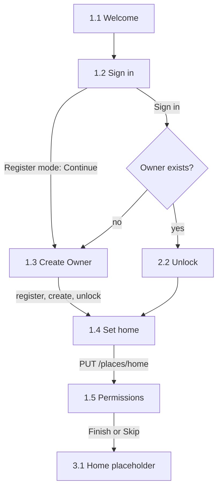

# Aster first run in React Native: phased prompts for Claude Code

This plan rebuilds screens 1.1–1.5 of the Aster design canvas in React Native for Android, in nine Claude Code phases. It reflects the canvas and specs as of 23 Sep 2026.

Sources: [Aster AI Assistant design canvas](https://claude.ai/artifact/9o4pyECfESN5n4YbcpZnj5) (row "1 · First run", plus 2.2 Unlock), [Aster integration spec](https://claude.ai/code/artifact/9f125718-f276-42cb-bd93-c8f45d7d2881) and [Aster backend architecture](https://claude.ai/code/artifact/e30cef08-4983-43b6-8e96-346583bc02e6). Claude Code can't open those links, so this file copies in everything it needs from them. "Aster" is a placeholder name. Rohan, Sunrise Residency and the other values on the canvas are sample data.

## Contents

0. How to use this file
1. Scope, stack and folders
2. Design tokens
3. Components
4. Screens
5. Flow, state and storage
6. API contract
7. Android permissions, cleartext and geofence
8. Phase prompts
9. Decisions to confirm
10. Final QA checklist

---

## 0. How to use this file

1. Create an empty project folder and save this file in it as `docs/aster-first-run-plan.md`. Every prompt points at that path.
2. Run the phases in order. Use one Claude Code session per phase, or clear the context between phases. `CLAUDE.md` (written in Phase 0) and this file carry the context forward.
3. Paste the prompt from §8 as it is. Each phase ends with checks and a report, so you can review and commit before starting the next one.
4. Phases 0–6 give you the whole first run, working on mock data. Phase 7 connects it to Laravel and zypherLL. Phase 8 is polish and QA.
5. For the bigger phases (4–7), you can ask Claude Code to show its plan before it writes code.

Fill these in a `.env` file when Phase 0 asks for them:

| Placeholder | Example | Used for |
|---|---|---|
| `ANDROID_PACKAGE` | `com.yourname.aster` | Android application id. Hard to change after the first install. |
| `GOOGLE_MAPS_API_KEY` | A "Maps SDK for Android" key | The map on 1.4 Set home |
| `HOME_LLM_HOST` | `192.168.1.20` | The only host a release build may call over plain HTTP (zypherLL) |
| `EXPO_PUBLIC_USE_MOCK_API` | `1` until Phase 7, then `0` | Mock server layer on or off |
| `EXPO_PUBLIC_DEV_SERVER_URL` | `https://aster.yourdomain.com` | Optional. Prefills 1.2 in dev builds only. |

If you can export or screenshot the first-run artboards (1.1–1.5 and 2.2), put them in `docs/design/`. Claude Code can open images and compare its screens against them in Phase 8.

---

## 1. Scope, stack and folders

### In scope
- 1.1 Welcome, 1.2 Sign in, 1.3 Create Owner, 1.4 Set home and 1.5 Permissions.
- 2.2 Unlock, in first-run mode only. It appears when signing in finds an existing Owner (a new phone), or when the app restarts after the Owner was created but before home was saved.
- A placeholder for 3.1 Home as the destination.

### Out of scope
Everything else on the canvas (Who's using, profiles, chat, voice, message capture, spoken alerts, home-mode switching, location uploads, settings). First run only prepares for those features: it gets permissions granted, registers the geofence and stores the tokens.

### Stack
- React Native with Expo (current stable SDK, TypeScript), expo-router, and a development build run with `npx expo run:android`. Expo Go can't load the native pieces this app needs.
- Android only. The canvas is Android-specific (notification access, SMS), so skip iOS work.
- Dark theme only.
- State: Zustand, with non-secret facts persisted in AsyncStorage. Secrets go in expo-secure-store.
- Animation: react-native-reanimated. Vector art: react-native-svg. Icons: lucide-react-native.
- Maps: react-native-maps (Google Maps on Android). Location, geocoding and geofence: expo-location with expo-task-manager.
- Biometrics: expo-local-authentication. Wi-Fi name: @react-native-community/netinfo. Keyboard: react-native-keyboard-controller.
- Runtime permissions: PermissionsAndroid (built into React Native) and expo-location. Special access (notification listener, battery) goes through a small local Expo module written in Kotlin.
- Tests: jest-expo and @testing-library/react-native.

The canvas's build note assumes Kotlin. Here is what replaces each first-run piece:

| Canvas build note (Kotlin) | This project |
|---|---|
| Jetpack Compose | React Native with expo-router |
| BiometricPrompt | expo-local-authentication; the PIN is kept in expo-secure-store with `requireAuthentication` |
| Play services geofencing | expo-location `startGeofencingAsync` with expo-task-manager |
| `network_security_config.xml` | An Expo config plugin (Phase 5, §7) |
| NotificationListenerService and battery "Unrestricted" | Local Expo module `modules/aster-system` (Kotlin) |
| OkHttp | `fetch` with AbortController timeouts |
| Room, WorkManager, okhttp-sse, SpeechRecognizer and TTS | Not needed for first run. Decide in later rows. |

### Folders
```text
app/                        routes (keep src/app/ if the template uses it)
  _layout.tsx               fonts, providers, launch routing
  (first-run)/_layout.tsx
  (first-run)/welcome.tsx         1.1
  (first-run)/sign-in.tsx         1.2
  (first-run)/create-owner.tsx    1.3
  (first-run)/unlock-owner.tsx    2.2, first-run mode
  (first-run)/set-home.tsx        1.4
  (first-run)/permissions.tsx     1.5
  home.tsx                  3.1 placeholder
  dev/gallery.tsx           component gallery, dev builds only
src/theme/                  colors, typography, spacing, map style
src/components/             shared components (§3)
src/features/first-run/     copy.ts, validators.ts, routing.ts, store.ts
src/services/api/           client.ts, types.ts, auth.ts, profiles.ts, places.ts, mock.ts
src/services/llm/           health.ts
src/services/permissions/   one entry per Permissions row
src/services/secure.ts      expo-secure-store wrapper
src/tasks/                  geofence-task.ts
modules/aster-system/       local Expo module (Kotlin)
plugins/                    with-home-llm-cleartext.js
scripts/                    dev-api.mjs (optional, Phase 7)
docs/                       this plan, design images, screenshots, status
```

---

## 2. Design tokens

All values come from the canvas. React Native needs absolute numbers, so line heights and letter spacing are in px, rounded to whole numbers.

### Colours

| Token | Value | Where |
|---|---|---|
| `bg` | `#0C1015` | Screen background, and text on accent fills |
| `surface` | `#14181D` | Inputs, cards, rows, segmented track |
| `surface2` | `#1C2127` | Permission icon tiles, Test pill |
| `border` | `#2C3239` | Input and card borders, dividers |
| `track` | `#272C33` | Empty progress segment, switch off |
| `borderStrong` | `#414950` | Switch-off border, empty PIN dot |
| `text` | `#EDF1EE` | Primary text |
| `textSecondary` | `#B8BEC5` | Subtitles, labels, secondary links |
| `textMuted` | `#9299A1` | Helper text, placeholders, step label |
| `accent` | `#6EECC1` | Primary button, progress, links, OK states |
| `accentPressed` | `#A8F5DA` | Pressed accent (the canvas's hover colour) |
| `accentTint` | `rgba(110,236,193,0.10)` | Icon tiles, callout, Allowed chip, selected segment |
| `accentBorder` | `rgba(110,236,193,0.32)` | Callout border, Allow pill, selected segment, valid input |
| `accentDeep` | `#1F8A68` | Orb gradient end |
| `accentLight` | `#E4FCF3` (orb), `#D9FBEF` (brand mark) | Orb gradient start |
| `warning` | `#FFC667`, tint `rgba(255,198,103,0.10)`, border `rgba(255,198,103,0.34)` | Taken from 3.1 Home. Use for "model loading" and soft warnings. |
| `danger` | `#F68678` | Taken from 5.1 Settings. Use for field errors. |
| Profile colours | Mint `#7FD9B8`, Lilac `#C7AFF5`, Sky `#82C7F0`, Peach `#F4B390` | 1.3 swatches, avatars |

Map palette (1.4): land `#0F1419`, parks `#12241E`, water `#12303A`, minor roads `#1D252D`, major roads `#2A333C`. Geofence fill `rgba(110,236,193,0.12)`, stroke `#6EECC1` at 1.5 px, dashed 5/5.

Contrast: `textMuted` on `bg` is about 6.6:1, `danger` on `bg` about 7.8:1, and `bg` text on `accent` about 13:1.

### Typography

Fonts: Bricolage Grotesque for display, Manrope for body, JetBrains Mono for addresses and the step label. Load them with the `@expo-google-fonts` packages, or bundle the TTFs from Google Fonts if a package is missing. On Android each weight is its own font family: set `fontFamily` per weight and never set `fontWeight` on a custom font. Set `includeFontPadding: false` on Android.

Weights needed: Bricolage 600 and 700; Manrope 400, 600 and 700; JetBrains Mono 400, 500 and 600.

Bricolage has an optical-size axis that browsers set automatically. Static font files fix one optical size, so compare headlines with the canvas and pick the closest cut.

| Style | Font | Size / line height | Letter spacing | Used in |
|---|---|---|---|---|
| `display` | Bricolage 700 | 35 / 38 | −0.7 | 1.1 headline |
| `title` | Bricolage 700 | 30 / 33 | −0.45 | 1.2–1.5 titles |
| `name` | Bricolage 700 | 26 / 36 | −0.26 | 2.2 profile name |
| `wordmark` | Bricolage 700 | 20 / 28 | −0.2 | "Aster" brand row |
| `avatar` | Bricolage 700 | 36 (35 on 2.2) | 0 | Avatar initial |
| `key` | Bricolage 600 | 26 | 0 | 2.2 keypad digits |
| `body` | Manrope 400 | 15 / 22 | 0 | Body, subtitles, inputs |
| `bodySmall` | Manrope 400 | 14 / 20 | 0 | Callout text |
| `rowTitle` | Manrope 700 (600 in toggle rows) | 15 / 22 | 0 | Row titles, address line |
| `label` | Manrope 700 | 13 / 18 | 0 | Field labels |
| `helper` | Manrope 400 | 13 / 18 | 0 | Helper text, row descriptions |
| `status` | Manrope 600 | 13 / 18 | 0 | Field status and error lines |
| `button` | Manrope 700 | 16 / 22 | 0 | Primary button |
| `link` | Manrope 700 | 14 / 20 | 0 | Secondary link, Allow pill, segments |
| `chip` | Manrope 700 | 13 / 18 | 0 | Allowed chip, Test pill |
| `mono` | JetBrains Mono 400 | 15 / 22 | 0 | Server and LLM address inputs |
| `monoSmall` | JetBrains Mono 500 | 12 / 16 | 0 | "Step 1 of 4" |
| `pin` | JetBrains Mono 400 | 22 / 28 | 8.8 (0.4 em) | 1.3 PIN input |
| `badge` | JetBrains Mono 600 | 10 / 12 | 0.6, uppercase | 2.2 "Owner" badge |

Cap `maxFontSizeMultiplier` at 1.3 on `display`, `title` and `button` so large system text doesn't break the layout. Body text scales normally.

### Spacing, sizes and radii
- Frames: artboards are 390 wide. 1.1–1.3 are 844 tall; 1.4 and 1.5 are 1000 tall, so they scroll. The canvas's 40 px top padding stands in for the status bar. Use safe-area insets instead, and never draw a fake status bar.
- Screen padding: 20 horizontal (Welcome 24). Content top 20 and bottom 24 (Welcome 8 and 28).
- Gaps between blocks: 18 on 1.2 and 1.5, 20 on 1.3, 16 in the 1.4 body.
- Header 56 tall with a 44×44 back button. Progress bar 4 tall with 4 segments and a gap of 6.
- Primary button 56 tall, radius 16. Input 52 tall, radius 14. Callout radius 16. Toggle card radius 20. Permission row radius 18. Segmented track radius 14, items radius 10. Pills and chips radius 999.
- Icon tiles are 36 (radius 11) or 40 (radius 12). Icons are 19–20 in tiles, 22 for back and 20 in buttons.
- Touch targets must be at least 44. Add `hitSlop` to the 36 px swatches, the 32 px Test pill and the 36 px Allow pills.

### Motion (Welcome orb)
- Ring: 87 px circle with a 2 px border in `rgba(110,236,193,0.5)`. Scale 0.82 → 1.18 and opacity 0.7 → 0 over 2600 ms, ease-out, repeating.
- Core: scale 1 → 1.05 → 1 over 3200 ms, ease-in-out, repeating.
- With reduced motion on (Reanimated `useReducedMotion`), the orb is static.
- Screens slide in from the right (native stack). Progress segments fill over 200 ms.

### Icons (lucide-react-native, stroke 1.8 unless noted)
- 1.1: `Server`, `MapPin`, `Lock`, `Volume2`
- Back: `ChevronLeft` at 22
- Buttons: `ArrowRight` and `Check`, stroke 2. Status lines and chips use `Check` at stroke 2.4.
- 1.2: `Cloud`
- 1.3: `Fingerprint`, `Clock`
- 1.4: `Search`, `LocateFixed`, `Wifi`, `RotateCw`
- 1.5: `Bell`, `MessageSquare`, `MapPin`, `Mic`, `Zap`, `Users`
- 2.2: `Fingerprint`, `Delete`

---

## 3. Components

Build these once in `src/components/`. Screens use theme tokens only, never hex values.

1. **Screen**: safe area at top and bottom, `bg` background, and a `KeyboardAwareScrollView` with `contentContainerStyle={{ flexGrow: 1 }}`. The content column carries the screen's padding and gap. A `footer` slot sits after a flexible spacer, so buttons rest at the bottom on tall phones and scroll into view on short ones (the canvas uses `margin-top: auto`).
2. **StepHeader**: a row 56 tall with padding 0 8. Left, a back button: 44 circle, transparent, `ChevronLeft` 22 in `text`, labelled "Back". Right, "Step N of 4" in `monoSmall` and `textMuted`, with 12 right padding. Under it, **ProgressSegments**: 4 flexible segments, gap 6, 4 tall, radius 999, padding 0 20. The first N are `accent`, the rest `track`.
3. **TitleBlock**: `title`, plus an optional subtitle in `body` and `textSecondary`. Gap 8 (6 on 1.4).
4. **PrimaryButton**: full width, 56 tall, radius 16, `accent` fill. Label in `button` style and `bg` colour, with a trailing 20 px icon (`ArrowRight`, or `Check` for "Save home" and "Finish setup") and a gap of 8. Pressed: `accentPressed`. Disabled: 40% opacity. Busy: a spinner in `bg` replaces the icon, the label stays, and presses are ignored.
5. **TextLink**: 44 tall, centred, `link` style in `textSecondary`. Pressed: `text`.
6. **TextField**: a label (`label`, `textSecondary`) with a gap of 8 above the input. The input is 52 tall with radius 14, a 1 px `border`, `surface` fill, padding 0 16, `body` text and `textMuted` placeholder. Variants: `mono` (JetBrains Mono 15) and `pin` (see Typography). The border turns `accentBorder` when focused or confirmed valid, and `danger` on error. Under the input sits one of: helper text (`helper`, `textMuted`); a status line (16 px icon plus `status` text in `accent`, `textMuted`, `warning` or `danger`); or an error (`status`, `danger`).
7. **InfoCallout**: a row with gap 12, padding 14/16, radius 16, `accentTint` fill and a 1 px `accentBorder`. A 20 px `accent` icon, then text in `bodySmall` and `text`.
8. **IconTile**: 36 (radius 11) or 40 (radius 12). Two tones: `accent` (accentTint fill, accent icon) and `neutral` (`surface2` fill, `textSecondary` icon).
9. **FeatureRow** (1.1): an accent IconTile 36, then text in `body` and `textSecondary` with 7 top padding. Gap 14; rows are 10 apart.
10. **Switch**: custom rather than the platform switch, 52×32, padding 4, radius 999, 1 px border. On: `accent` fill and border, knob `bg`, knob on the right. Off: `track` fill, `borderStrong` border, knob `textMuted`, knob on the left. Knob 22. The knob slides in 150 ms. Uses `accessibilityRole="switch"` with a checked state, labelled with the row title.
11. **ToggleCard and ToggleRow**: the card has `surface` fill, 1 px `border`, radius 20, and clips its children. A row has padding 12/16 and gap 14: accent IconTile 36, then the title (`rowTitle` at 600) with an optional subtitle (`helper`, gap 2), then the Switch. A 1 px `border` divider separates rows. Tapping anywhere on the row toggles it.
12. **SwatchPicker**: four 36 px circles, gap 14, 4 px left inset. The selected swatch gets a 3 px `bg` gap and then a 2 px `text` ring (canvas: `box-shadow: 0 0 0 3px #0C1015, 0 0 0 5px #EDF1EE`). Use React Native's `boxShadow` style if the New Architecture supports it here, otherwise a 46 px ring wrapper. It's a radio group labelled "Profile colour", with each radio labelled Mint, Lilac, Sky or Peach.
13. **Avatar**: an 84 px circle filled with the profile colour, showing the initial in `avatar` style and `bg` colour. Decorative, so hidden from screen readers.
14. **Segmented**: the track has padding 4, gap 4, radius 14, `surface` fill and a 1 px `border`. Items are flexible, 40 tall, radius 10, in `link` style. Selected: `accentTint` fill, `accentBorder` border, `accent` text. Others: transparent with `textSecondary` text. It's a radio group.
15. **SmallPill** (Test): 32 tall, padding 0 12, radius 999, 1 px `border`, `surface2` fill, `chip` text in `textSecondary`, and a 14 px leading icon with a gap of 6.
16. **PermissionRow**: a card with padding 14 14 14 16, radius 18, `surface` fill, 1 px `border` and gap 14. It holds a neutral IconTile 40, then the title (`rowTitle` at 700) and description (`helper`, gap 2), then a trailing control. The control is either an **AllowPill** (36 tall, padding 0 16, radius 999, 1 px `accentBorder`, transparent, `link` in `accent`) or an **AllowedChip** (32 tall, padding 0 10, radius 999, `accentTint`, `Check` 15 at stroke 2.4, `chip` in `accent`, gap 5). The pill is disabled while a system screen is open.
17. **AsterOrb** (1.1): a 190 box with an outer ring (full size, 1 px `rgba(110,236,193,0.14)`), an inner ring (inset 25, 1 px `rgba(110,236,193,0.26)`), and the animated ring and core (87 px) from Motion. The core is a radial gradient centred at 34% 30%: `#E4FCF3` at 0%, `#6EECC1` at 38%, `#1F8A68` at 100%. Draw it with react-native-svg. Add the glow (`0 0 57px rgba(110,236,193,0.42)`) with `boxShadow` or an SVG halo. Hidden from screen readers.
18. **BrandMark**: a 22 px orb (gradient `#D9FBEF` at 0%, `#6EECC1` at 42%, `#1F8A68` at 100%, centred at 35% 30%, with a 13 px glow in `rgba(110,236,193,0.35)`), then "Aster" in `wordmark`, with a gap of 10.
19. **PinDots and Keypad** (2.2): see §4.6.

Add a dev-only gallery route that shows every component in every state.

---

## 4. Screens

Text in quotes is exact copy. Lines marked *(proposed)* cover states the canvas doesn't draw; keep that wording short and plain like the rest. The canvas's sample values (Rohan, rohan@example.com, Sunrise Residency, Rohan-Home-5G, 192.168.1.20 and the password shown) are illustrations. Use them as placeholders, never as defaults, and never ship the sample password.

### 4.1 Screen 1.1 Welcome (390×844)

Layout, top to bottom, with padding 8 24 28 inside the safe area:
1. BrandMark.
2. AsterOrb, centred in a flexible area that takes the leftover height. Size it to fit that area (at most 190, measured with `onLayout`), and hide it below 96. The screen may scroll on very short phones.
3. Headline in `display`: "Your assistant, running on your own computer."
4. Four FeatureRows, starting 20 below the headline:
   - `Server`: "Answers come from the model on your home computer."
   - `MapPin`: "Wakes up by itself when you get home."
   - `Lock`: "Everyone gets a locked profile. No one can open another person's chats."
   - `Volume2`: "Reads out the messages you miss."
5. 24 below the rows, PrimaryButton "Set up Aster" (`ArrowRight`). 12 below it, a centred caption in `helper` and `textMuted`: "You'll need your Aster server's address."

Behaviour: the button goes to 1.2. Welcome is the root, so it has no back button, and Android back exits the app.

### 4.2 Screen 1.2 Sign in (390×844, Step 1 of 4)

Layout: StepHeader (step 1, back goes to 1.1), then content with gap 18:
1. Title: "Sign in to your Aster server"
2. InfoCallout (`Cloud`): "Your account, profiles and chat history live on this server, so they work anywhere. Answers still come from your computer at home."
3. Mono TextField "Server address". Placeholder "https://aster.yourdomain.com", `keyboardType="url"`, no autocapitalise or autocorrect.
4. TextField "Email". Placeholder "you@example.com" *(proposed)*, email keyboard, `autoComplete="email"`.
5. TextField "Password": secure, `autoComplete="password"`.
6. Footer with gap 8: PrimaryButton "Sign in" (`ArrowRight`), then TextLink "First time? Create the household account".

Server check: runs 600 ms after typing stops, and on blur. It calls `GET {server}/up` with a 5 s timeout (§6).
- Checking: muted spinner and "Checking…" *(proposed)*
- OK: accent `Check` and "Reachable · HTTPS · {ms} ms", with the input border in `accentBorder`
- Not https: danger "Use an https:// address" *(proposed)*. Dev builds may allow `http://localhost` and `http://10.0.2.2`.
- Failed: danger "Can't reach this server" *(proposed)*

Sign in is enabled when the server is reachable, the email is valid and the password isn't empty. On success, follow §5 (an existing Owner goes to 2.2, otherwise to 1.3). Errors:
- Wrong credentials: danger under Password, "Email or password is wrong." *(proposed)*
- 429: "Too many tries. Try again in {n} s." *(proposed)*
- Network: the server status line shows the failed state.

Register mode (the link) swaps copy on the same layout: title "Create the household account", primary "Continue", link "Already set up? Sign in", and helper under Password "At least 8 characters" *(all proposed)*. Continue validates the three fields and goes to 1.3, carrying email and password in memory only. The account itself is created at 1.3, because Laravel's `users` row needs a name (§5, §9).

### 4.3 Screen 1.3 Create Owner (390×844, Step 2 of 4)

Layout: StepHeader (step 2, back goes to 1.2), then content with gap 20:
1. Title "Create the Owner profile", with subtitle "The Owner sets up other profiles and is the only one who can see this phone's messages and location."
2. A row with gap 20. Left, Avatar 84: filled with the selected colour, showing the first letter of Name uppercased (no letter while Name is empty). Right, a column with gap 12: label "Profile colour" and the SwatchPicker, Mint by default.
3. TextField "Name". Placeholder "Your name" *(proposed)*, `autoCapitalize="words"`, at most 40 characters.
4. Pin TextField "6-digit PIN": number pad, masked, 6 digits at most, digits only, autofill off (`autoComplete="off"`, `importantForAutofill="no"`). Helper: "You'll enter this each time you open your profile. Your server keeps only a scrambled copy."
5. ToggleCard:
   - `Fingerprint`, "Unlock with fingerprint", on by default.
   - `Clock`, "Lock when I leave", subtitle "After 2 minutes in the background", on by default.
6. Footer: PrimaryButton "Create profile" (`ArrowRight`). Enabled when Name has a non-space character and the PIN has 6 digits.

Behaviour:
- If the phone has no fingerprint hardware or none enrolled (`hasHardwareAsync`, `isEnrolledAsync`), show the fingerprint switch off and disabled, with subtitle "Set up a fingerprint in Android settings first" *(proposed)*.
- Create profile runs the chain in §5: register first if we came from register mode, then create the Owner, then unlock. The button stays busy throughout. On success, go to 1.4.
- With fingerprint on, save the PIN in SecureStore with `requireAuthentication: true` after unlock succeeds (Android shows a biometric prompt). If the prompt is cancelled, turn the switch off and carry on.
- Returning to 1.3 after the Owner exists: the button reads "Save profile" *(proposed)*, and changes go through `PATCH /profiles/{id}` (name, colour, lock). The PIN field is disabled, with helper "Change your PIN later in Settings." *(proposed)*

### 4.4 Screen 1.4 Set home (390×1000, Step 3 of 4, scrolls)

Layout: StepHeader (step 3, back goes to 1.3), then:
1. TitleBlock with padding 18 20 14 and gap 6: "Where is home?" and "Aster switches on when your phone gets here."
2. Map: full width, 270 tall, with a 1 px `border` top and bottom, in the dark style below. Accessibility label: "Map with your home and the area around it".
   - Search bar overlaid at top 12, left and right 16: 48 tall, radius 14, `surface` fill, 1 px `border`, shadow `0 8px 24px rgba(0,0,0,0.35)`, padding 0 6 0 14, gap 10. It holds a `Search` icon (18, `textMuted`), then an input (placeholder and label "Search for your address", return key "search"), then a 40 px round button with `LocateFixed` 20 in `accent`, labelled "Use my current location".
   - Pin: the canvas pin, a 22×30 teardrop in `accent` with a 4.2 px `bg` dot, anchored at its tip. SVG: viewBox `0 0 22 30`, path `M11 30 C5 22 0 17 0 11 A11 11 0 0 1 22 11 C22 17 17 22 11 30 Z`, dot at (11, 11). Tap or long-press the map to move it.
   - Geofence: a `Circle` around the pin with radius equal to the selected metres, filled `rgba(110,236,193,0.12)` with a `#6EECC1` stroke at 1.5, dashed 5/5 (solid if dashes don't work on Android). After a radius change, fit the circle in view with top padding for the search bar.
3. Body, with padding 16 20 24 and gap 16:
   - Address row with gap 12: accent IconTile 40 with `MapPin`, then the address (`rowTitle` at 700) over "Aster turns on within {radius} m of here" (`helper`). Before a point is picked, it reads "Search for your address or use your location" *(proposed)*.
   - Label "Home area", then Segmented "100 m", "150 m", "300 m", "500 m", with 150 selected by default.
   - TextField "Home Wi-Fi (optional)". Placeholder "Your Wi-Fi name" *(proposed)*. Helper: "Confirms you’re really home before the assistant turns on."
   - Mono TextField "Home LLM server". Placeholder "http://192.168.1.20:8000". Under it, a row: `Wifi` 15 with "Test works only on home Wi-Fi" (`helper`, flexible), then SmallPill "Test" (`RotateCw`).
   - Footer: PrimaryButton "Save home" (`Check`).

Behaviour:
- Ask for location permission in context, when the user taps "Use my current location" or searches (Android geocoding needs it). If it's denied, the address row reads "Location is off. Search for your address instead." *(proposed)*
- Search calls `Location.geocodeAsync(query)`. The first result moves the pin and camera, and `reverseGeocodeAsync` builds the address line. No result: "No match for “{query}”" *(proposed)*.
- Wi-Fi: once location permission is granted and the phone is on Wi-Fi, fill the empty field with NetInfo's SSID, skipping `<unknown ssid>`.
- LLM address: must be `http://` or `https://` with a host. If the host isn't private (10.x, 172.16–31.x, 192.168.x, `.local`, `.lan`), show a warning: "This looks like a public address. Keep zypherLL on your home network." *(proposed)*
- Test calls `GET {llm}/health` with a 3 s timeout and no token. The result replaces the hint line *(all proposed)*:
  - ready: accent "Ready · {model} · {ms} ms"
  - `loading`: warning "Model is loading. Try again in a minute."
  - 500: danger "Model failed to load: {error}"
  - no reply: danger "No reply in 3 s. Are you on home Wi-Fi?"
  - host blocked by the build: danger "This build only allows plain HTTP to {HOME_LLM_HOST}."
  The pill shows a spinner while testing.
- Save home is enabled once a point is picked and the LLM address is valid. A passing test isn't required, because people often set up away from home. It sends `PUT /places/home`, keeps a local copy and goes to 1.5. The geofence is registered later, once 1.5 has "Allow all the time" (§7).

Map style, for react-native-maps `customMapStyle` (keep it in `src/theme/mapStyle.ts`):
```json
[
  { "elementType": "geometry", "stylers": [{ "color": "#0F1419" }] },
  { "elementType": "labels.icon", "stylers": [{ "visibility": "off" }] },
  { "elementType": "labels.text.fill", "stylers": [{ "color": "#9299A1" }] },
  { "elementType": "labels.text.stroke", "stylers": [{ "color": "#0C1015" }] },
  { "featureType": "administrative", "elementType": "geometry", "stylers": [{ "visibility": "off" }] },
  { "featureType": "poi", "stylers": [{ "visibility": "off" }] },
  { "featureType": "poi.park", "elementType": "geometry", "stylers": [{ "visibility": "on" }, { "color": "#12241E" }] },
  { "featureType": "road", "elementType": "geometry", "stylers": [{ "color": "#1D252D" }] },
  { "featureType": "road.arterial", "elementType": "geometry", "stylers": [{ "color": "#2A333C" }] },
  { "featureType": "road.highway", "elementType": "geometry", "stylers": [{ "color": "#2A333C" }] },
  { "featureType": "transit", "stylers": [{ "visibility": "off" }] },
  { "featureType": "water", "elementType": "geometry", "stylers": [{ "color": "#12303A" }] }
]
```

### 4.5 Screen 1.5 Permissions (390×1000, Step 4 of 4, scrolls)

Layout: StepHeader (step 4, back goes to 1.4), then content with gap 18:
1. Title "Let Aster listen for you", with subtitle "Android asks for each one separately. For location, pick “Allow all the time”."
2. Six PermissionRows, 10 apart:

| Icon | Title | Description |
|---|---|---|
| `Bell` | "Notification access" | "Reads WhatsApp and Google Chat messages as they arrive." |
| `MessageSquare` | "SMS" | "Reads your text messages." |
| `MapPin` | "Location, all the time" | "Knows when you get home, and saves your location to your server." |
| `Mic` | "Microphone" | "For voice chat and the “Hey Aster” wake word." |
| `Zap` | "Run in background" | "Keeps listening after you close the app, with a small ongoing notification." |
| `Users` | "Contacts" | "Matches senders like “Mom” to your VIP list." |

3. Footer with gap 8: PrimaryButton "Finish setup" (`Check`), then TextLink "Skip for now".

Behaviour:
- Each row shows the real status; the canvas's pre-granted rows are demo state. Allow runs the flow in §7. Statuses refresh when the app returns to the foreground.
- If the user blocked a permission ("Don't ask again"), the pill still says Allow but opens the app's settings page.
- "Finish setup" and "Skip for now" both mark first run done and replace the stack with Home (the 3.1 placeholder). Skipped permissions stay recorded so Settings can show them later.
- When "Location, all the time" becomes Allowed and a home place exists, register the geofence (§7).

### 4.6 Screen 2.2 Unlock, first-run mode (390×844)

Used only when signing in finds an existing Owner, or when the app restarts after the Owner was created but before home was saved. There's no step header, just a 56 tall row with a back button labelled "Back" that returns to 1.2. Layout:
1. A centred column with padding 4 28 28: Avatar 84 (letter size 35); the name in `name` style 14 below; then, 6 below, an "Owner" badge (20 tall, padding 0 7, radius 6, `accentTint` fill, 1 px `accentBorder`, `badge` style in `accent`).
2. 28 below: "Enter your PIN" (Manrope 16, `textSecondary`).
3. 16 below: six dots with a gap of 16. Each is a 14 px circle with a 1.5 px border: `borderStrong` when empty, `accent` fill and border when filled.
4. 14 below, a 20 px line: "Or touch the fingerprint sensor" (`textMuted`) while typing, and "PIN accepted" (`accent`, 700) when done.
5. 22 below: the keypad, 3 columns with a gap of 12. Keys are 64 tall, radius 20, `surface` fill, 1 px `border`, digits in `key` style. The bottom row holds a fingerprint key (`accentTint` fill, `accentBorder`, `Fingerprint` 28 in `accent`, labelled "Unlock with fingerprint"), 0, and a delete key (`Delete` 24 in `textSecondary`, labelled "Delete last digit").
6. Footer: "5 wrong tries lock this profile for 30 seconds." (`helper`, centred).

Behaviour:
- The 6th digit submits `POST /profiles/{id}/unlock`.
- A wrong PIN shakes and clears the dots and shows "Wrong PIN" in danger *(proposed)*.
- 429 disables the keypad and shows "Locked. Try again in {n} s" *(proposed)*, counting down.
- On success, show "PIN accepted" and continue after 600 ms to where §5 says (usually 1.4, prefilled from `GET /places/home`). First-run mode skips the canvas's "Open {name}'s Aster" button.
- If this phone has no stored biometric PIN, leave the fingerprint cell empty. Fingerprint unlock can be turned on later in Settings.

---

## 5. Flow, state and storage



### Server calls, in order
These follow the backend architecture doc's first-run steps.
- **New household.** At 1.2 in register mode, Continue only validates. At 1.3, Create profile calls `POST /auth/register` (name is the Owner's name, plus email, password and device_name) and stores the device token. Then it calls `POST /profiles` for the Owner, then `POST /profiles/{id}/unlock` with the PIN, and keeps the profile token and llm_token in memory. At 1.4, Save home calls `PUT /places/home` with the Owner profile token.
- **Existing household** (for example a new phone). At 1.2, Sign in calls `POST /auth/login` and stores the device token, then `GET /profiles`. If an Owner exists, go to 2.2, unlock, then `GET /places/home` to prefill 1.4. If not, go to 1.3 (create the Owner and unlock), then 1.4.

### Where things are kept

| Persisted (AsyncStorage) | Secret (expo-secure-store) | Memory only |
|---|---|---|
| Server URL; email (for prefill); Owner id, name and colour; home place (address, lat, lng, radius_m, wifi_ssid, llm_url); fingerprint and lock preferences; permissions step done; first run done | Device token; the PIN, only when fingerprint is on (behind `requireAuthentication`) | Password (register mode only); profile token; llm_token; token expiry |

### Launch routing
Use the first rule that matches. Implement it as a pure function, `resolveFirstRunRoute(state)`, and redirect with replace.

| # | State | Route |
|---|---|---|
| 1 | First run done | Home (the 3.1 placeholder for now; later rows switch this to 2.1 Who's using) |
| 2 | No device token, server never entered | 1.1 Welcome |
| 3 | No device token, server entered | 1.2 Sign in |
| 4 | Device token, no Owner | 1.3 Create Owner |
| 5 | Owner exists, home not saved, not unlocked this session | 2.2 Unlock |
| 6 | Unlocked, home not saved | 1.4 Set home |
| 7 | Home saved, permissions step not done | 1.5 Permissions |

Register mode reaches 1.3 without a device token by pushing from 1.2. If the in-memory credentials are gone (the app was killed), send the user back to 1.2.

### Rules
- Each server write happens once, and going back never repeats one. After sign-in, 1.2 shows the saved server and email and signs in again only if either changed. After the Owner exists, 1.3 switches to Save profile (PATCH). `PUT /places/home` is safe to repeat.
- Moving forward pushes a screen. Resuming and finishing replace the stack. Welcome is the root.
- Don't arm "Lock when I leave" (2 minutes in the background) until first run is finished, because 1.5 sends people to system settings and back.
- Never keep the password or PIN in plain storage, and never log tokens, PINs or passwords.
- A 401 on a device-token call deletes the device token and returns to 1.2 with "Please sign in again." *(proposed)*

---

## 6. API contract

From the spec: every Laravel endpoint sits under `/api`, speaks JSON over HTTPS and takes a Sanctum bearer token. The device token has no expiry. The profile token and llm_token last 12 hours. Unlock allows 5 tries, then locks for 30 s and returns 429 with `retry_after`. `/auth/register` is refused once the household exists. A device token can create only the first profile. The server never returns `pin_hash`. Login and unlock are rate-limited.

| Screen | Call | Token | Body | Success | Errors to handle |
|---|---|---|---|---|---|
| 1.2 server check | `GET {server}/up` | None | None | 200 | Timeout (5 s), non-200 |
| 1.2 sign in | `POST /api/auth/login` | None | email, password, device_name | 200 `{ token }` | 422 or 401 wrong credentials, 429 |
| 1.3 new household | `POST /api/auth/register` | None | name, email, password, device_name | 201 `{ token }` | 422 fields; 403 or 409 household exists |
| After sign in | `GET /api/profiles` | Device | None | 200 `{ data: [{ id, name, color, role }] }` | 401 |
| 1.3 create Owner | `POST /api/profiles` | Device (first profile only) | name, color, role `"owner"`, pin, auto_lock_minutes | 201 `{ data: profile }` | 422; 403 if a profile already exists |
| 1.3 edit after back | `PATCH /api/profiles/{id}` | Owner profile | name, color, auto_lock_minutes (any) | 200 | 422 |
| 1.3 and 2.2 unlock | `POST /api/profiles/{id}/unlock` | Device | pin | 200 `{ profile_token, llm_token, expires_at }` | 422 wrong PIN; 429 `{ retry_after }` |
| 1.4 prefill | `GET /api/places/home` | Owner profile | None | 200 `{ data: place }` | 404 means none |
| 1.4 save | `PUT /api/places/home` | Owner profile | name `"Home"`, address, lat, lng, radius_m, wifi_ssid, llm_url | 200 `{ data: place }` | 422 |
| 1.4 test | `GET {llm_url}/health` | None (zypherLL) | None | 200 `{ status: "ready" \| "loading", model? }` | 500 model failed to load; timeout (3 s) |

Assumptions, because the spec lists routes but not bodies: the field names above, the `data` wrappers (Laravel API resources), `device_name`, `auto_lock_minutes` (2 when "Lock when I leave" is on, null when off), colour sent as hex, and `GET /up`. That last one is Laravel's default health route and isn't in the spec's route list. Keep every shape in `src/services/api/types.ts` so there's one place to adjust against the Laravel controllers. The server may also create a Guest profile at the same time as the Owner; first run ignores it.

Errors:
- Send `Accept: application/json` on every call so Laravel returns JSON errors.
- A 422 looks like `{ message, errors: { field: [messages] } }`. Show the first message under the matching field, and fall back to `message`.
- 429 retry time comes from `retry_after` in the body or the `Retry-After` header.
- Timeouts: Laravel 15 s, `/up` 5 s, `/health` 3 s (the spec's value).
- First run doesn't use the llm_token; keep it for chat. The app never holds `ZYPHER_API_KEY`.

---

## 7. Android permissions, cleartext and geofence

### Permissions matrix

| Row | Android permission | How the app asks | Shows "Allowed" when |
|---|---|---|---|
| Notification access | `BIND_NOTIFICATION_LISTENER_SERVICE`, declared on a NotificationListenerService. It's special access, not a runtime prompt. | Opens Notification access settings (Aster's own page on Android 11+) through the local module | Aster is in the list of enabled listeners |
| SMS | `READ_SMS`, `RECEIVE_SMS` | Runtime prompt | Both granted |
| Location, all the time | `ACCESS_FINE_LOCATION`, `ACCESS_COARSE_LOCATION`, then `ACCESS_BACKGROUND_LOCATION` | expo-location: foreground prompt first (skipped if 1.4 already got it), then background. On Android 11+ that opens a settings page where the user picks "Allow all the time". | Background granted |
| Microphone | `RECORD_AUDIO` | Runtime prompt | Granted |
| Run in background | `POST_NOTIFICATIONS` (Android 13+), `REQUEST_IGNORE_BATTERY_OPTIMIZATIONS` | Notification prompt, then the system battery dialog through the local module | Notifications granted (or Android below 13) and battery optimisation ignored ("Unrestricted") |
| Contacts | `READ_CONTACTS` | Runtime prompt | Granted |

Also declare `ACCESS_WIFI_STATE` and `ACCESS_NETWORK_STATE` for NetInfo's Wi-Fi name. Enable background location in the expo-location config plugin (`isAndroidBackgroundLocationEnabled`).

Local module `modules/aster-system` (Kotlin):
- `isNotificationListenerEnabled()`, via `NotificationManagerCompat.getEnabledListenerPackages`.
- `openNotificationListenerSettings()`: `ACTION_NOTIFICATION_LISTENER_DETAIL_SETTINGS` with Aster's component on Android 11+, and `ACTION_NOTIFICATION_LISTENER_SETTINGS` as the fallback.
- `isIgnoringBatteryOptimizations()`, via `PowerManager`.
- `requestIgnoreBatteryOptimizations()`: `ACTION_REQUEST_IGNORE_BATTERY_OPTIMIZATIONS` with `package:` data.
- A stub `AsterNotificationListener` service with the bind permission, so Aster appears in the Notification access list. It does nothing yet; message capture comes in row 4.

Notes:
- Google Play restricts `READ_SMS`, `RECEIVE_SMS` and battery-optimisation exemptions. That's fine for a personal build, and the canvas notes the same for SMS.
- On Android 13+, an APK installed from a browser or file manager may show "Restricted setting" for notification access. The fix is App info → ⋮ → "Allow restricted settings". Consider a helper line under that row if the user comes back without enabling it *(proposed)*.
- The foreground service types (microphone, location) for the wake word and spoken alerts belong to later rows, not first run.

### Cleartext only for the home LLM
zypherLL is plain HTTP on the home network, and Laravel stays HTTPS. Write `plugins/with-home-llm-cleartext.js`, an Expo config plugin that:
- writes the main config, used by release builds:
```xml
<!-- android/app/src/main/res/xml/network_security_config.xml -->
<network-security-config>
  <base-config cleartextTrafficPermitted="false" />
  <domain-config cleartextTrafficPermitted="true">
    <domain includeSubdomains="false">HOME_LLM_HOST</domain>
  </domain-config>
</network-security-config>
```
- writes a debug-only overlay at `android/app/src/debug/res/xml/network_security_config.xml` with `<base-config cleartextTrafficPermitted="true" />`, so Metro and the dev API keep working in debug builds;
- sets `android:networkSecurityConfig="@xml/network_security_config"` on `<application>`.

`HOME_LLM_HOST` comes from `.env` at build time. Reserve the PC's IP in the router's DHCP settings, or rebuild when it changes.

### Geofence
- Define the task at module scope in `src/tasks/geofence-task.ts` as `aster-home-geofence`, and import it from the root layout so it exists when Android wakes the app.
- Register it when background location is granted and a home place exists: `Location.startGeofencingAsync("aster-home-geofence", [{ identifier: "home", latitude, longitude, radius: radius_m, notifyOnEnter: true, notifyOnExit: true }])`.
- For now the task only records enter and exit events with a timestamp. The Wi-Fi check, `/health` and home mode come in row 3.
- Re-register on every app start while the permission is still granted. The canvas notes that geofences must be registered again after a reboot. Check whether expo-location restores them on your phone; if not, add a BOOT_COMPLETED receiver to the local module later.

---

## 8. Phase prompts

| Phase | Builds | Result |
|---|---|---|
| 0 | Project setup | Dev build runs with the fonts loaded |
| 1 | Tokens and components | Dev gallery |
| 2 | Routes, state and mocks | Tap-through on mock data; resume works |
| 3 | 1.1 Welcome, 1.2 Sign in | Two finished screens |
| 4 | 1.3 Create Owner, 2.2 Unlock | PIN flows |
| 5 | 1.4 Set home | Map, search, LLM test, cleartext |
| 6 | 1.5 Permissions | Native permissions, geofence |
| 7 | Real API | Laravel and zypherLL connected |
| 8 | Polish and QA | §10 ticked |

### Phase 0: Project setup

```text
You're starting Aster, a React Native (Expo) app for Android. The plan is docs/aster-first-run-plan.md. Read §0 and §1 now; later phases use the rest. If that file isn't there, stop and tell me.

Goal: an empty, correctly configured Expo app that builds and runs as a development build on Android.

1. Scaffold with `npx create-expo-app@latest` (TypeScript, expo-router). The folder already holds docs/, so scaffold into a temporary folder and move the contents up, keeping docs/. Initialise git if needed. Remove the template's example screens, components and assets.
2. Use app.config.ts, reading .env: name "Aster", slug "aster", scheme "aster", android.package from ANDROID_PACKAGE, portrait only, userInterfaceStyle "dark", splash and adaptive-icon background #0C1015. Skip iOS configuration. Add .env.example with the placeholders from §0, and put .env in .gitignore.
3. Install with `npx expo install` so versions match the SDK: react-native-reanimated, react-native-svg, react-native-safe-area-context, react-native-screens, react-native-gesture-handler, lucide-react-native, expo-font, expo-splash-screen, expo-status-bar, expo-system-ui, @expo-google-fonts/bricolage-grotesque, @expo-google-fonts/manrope, @expo-google-fonts/jetbrains-mono, zustand, @react-native-async-storage/async-storage, expo-secure-store, expo-local-authentication, expo-location, expo-task-manager, expo-device, expo-constants, @react-native-community/netinfo, react-native-maps, react-native-keyboard-controller. Dev dependencies: jest-expo, jest, @testing-library/react-native, @types/jest, prettier. If a font package doesn't exist, bundle the TTFs from Google Fonts instead and tell me.
4. android/ and ios/ are generated by prebuild and stay out of git. We run with `npx expo run:android`, not Expo Go.
5. Root layout: load the font weights listed in §2 Typography and keep the splash screen up until they're loaded. Wrap the app in GestureHandlerRootView, SafeAreaProvider and KeyboardProvider. Use a light status bar, and set the system UI background to #0C1015 so there's no white flash.
6. Temporary index route: "Aster" in Bricolage Grotesque 700 and one line of Manrope 400 on #0C1015, to prove the fonts load.
7. package.json scripts: typecheck (tsc --noEmit), lint (expo lint), test (jest), android (expo run:android). Configure jest-expo.
8. Write CLAUDE.md at the repo root, 60 lines at most: what Aster is (one paragraph from §1), the commands, the folder layout from §1, and these rules:
   - Colours, fonts and sizes come only from src/theme.
   - Screen text comes only from src/features/first-run/copy.ts.
   - Canvas sample data is never a default value.
   - Android only.
   - Never log tokens, PINs or passwords.
   - docs/aster-first-run-plan.md is the source of truth; report any deviation instead of making it silently.
9. Make the first commit.

Checks: `npm run typecheck` and `npm run lint` pass, and `npx expo run:android` opens the dark screen with both fonts rendering.
Stop and report: what you installed (with versions), anything you couldn't do, and any deviation from the plan.
```

### Phase 1: Design tokens and component kit

```text
Read docs/aster-first-run-plan.md §2 (tokens) and §3 (components).

Goal: the theme and every shared component, shown in a dev-only gallery. No screens yet.

1. src/theme: colors.ts, typography.ts, spacing.ts, mapStyle.ts and index.ts, exporting a typed `theme`. Text styles follow the §2 table exactly: px line heights and letter spacing, fontFamily per weight, no fontWeight, includeFontPadding false.
2. src/components: a Text component that takes a `variant` from the typography table and a `tone` from the text colours, then components 1–18 from §3 with the listed sizes, colours and states. Keep props small and typed. Icons come from lucide-react-native with the stroke widths in §2.
3. AsterOrb and BrandMark: react-native-svg radial gradients and Reanimated loops exactly as §2 Motion describes. Static when reduced motion is on.
4. Accessibility built in: the roles, labels and states §3 lists, and hitSlop so every control reaches 44×44.
5. app/dev/gallery.tsx shows every component in every state: Switch on, off and disabled; TextField idle, focused, valid, error, mono and pin; PrimaryButton normal, pressed, disabled and busy; AllowPill and AllowedChip; Segmented; SwatchPicker; the orb. Only reachable in __DEV__ (for example, long-press the index wordmark).
6. Unit tests: a sample of theme values match §2; Switch and Segmented fire their callbacks and expose accessibility state.

Checks: typecheck, lint and tests pass. A search for hex colours (#RGB to #RRGGBBAA) in app/ and src/ finds none outside src/theme. The gallery renders on the device with no layout warnings.
Stop and report, including any value you had to approximate (for example shadows or dashed strokes on Android).
```

### Phase 2: Navigation, first-run state and mock services

```text
Read docs/aster-first-run-plan.md §4 (for copy only), §5 (flow, state, storage) and §6 (API contract).

Goal: the whole first run is navigable on mock data and resumes correctly after the app is killed. Screens are placeholders that later phases fill in.

1. Routes (expo-router native stack, sliding from the right): (first-run)/welcome, sign-in, create-owner, unlock-owner, set-home and permissions; home (the 3.1 placeholder); dev/gallery. For now each first-run screen shows its title from copy.ts, the StepHeader where §4 has one, and a button that moves to the next route.
2. src/features/first-run/copy.ts: every string in §4, including the ones marked (proposed), grouped by screen. Mark the proposed ones with a comment.
3. State (Zustand): a persisted slice (AsyncStorage) for the non-secret facts in §5's storage table, and a memory-only slice for the register-mode password, the profile token, the llm_token and their expiry. src/services/secure.ts wraps expo-secure-store for the device token and the biometric PIN. A unit test asserts that the persisted slice never contains a token, PIN or password.
4. Launch routing exactly as §5's table, as a pure function resolveFirstRunRoute(state) with a unit test for every row. The root layout redirects with it using replace, not push.
5. Service interfaces in src/services/api/types.ts for the calls in §6 (auth, profiles, places), plus src/services/llm/health.ts. Mocks go in src/services/api/mock.ts behind EXPO_PUBLIC_USE_MOCK_API: 400–800 ms latency, state kept in AsyncStorage, and the same errors as §6 (wrong password gives 422; household exists gives 403; wrong PIN gives 422 with the 5-try, 30 s lock returning 429 with retry_after). Document the trigger inputs at the top of the file (for example, the password "wrong").
6. Home placeholder: says it stands in for 3.1, lists the saved first-run facts (no secrets), and in __DEV__ shows a "Reset first run" button that clears storage, the secure store and the mock server.
7. Back rules from §5: Android back matches the header back button; Welcome is the root; auto-lock isn't armed during first run.

Checks: typecheck, lint and tests pass. On the device I can go from Welcome to Home on mocks, and killing the app on each screen and reopening it lands where §5 says.
Stop and report.
```

### Phase 3: 1.1 Welcome and 1.2 Sign in

```text
Read docs/aster-first-run-plan.md §4.1, §4.2, and the /up and auth rows of §6.

Goal: Welcome and Sign in look exactly like the canvas and behave as specified, on mock data.

1. Build 1.1 per §4.1: BrandMark, the orb sized to the flexible area, the headline, four FeatureRows, the button and the caption, with the exact paddings and gaps.
2. Build 1.2 per §4.2: StepHeader at step 1, title, callout, three fields, then the footer button and link.
3. Server check: 600 ms debounce and on blur, with the four states in §4.2. Put the URL rules in src/features/first-run/validators.ts, with unit tests: https required; http only for localhost and 10.0.2.2 in __DEV__; trims spaces and trailing slashes.
4. The Sign in button is enabled only as §4.2 says, busy while calling, maps errors to the copy in §4.2, and on success follows §5 (the mock decides whether an Owner exists).
5. Register mode: the link swaps copy as §4.2 describes, with no layout change. Continue validates and pushes 1.3 with email and password in memory only.
6. Keyboard: fields stay visible above the keyboard, Next moves from email to password, and Done on the password field submits.

Checks: typecheck, lint and tests pass. On a Pixel 5-sized emulator (about 393 dp wide) both screens match the §4 measurements, every string matches copy.ts, and TalkBack reads each field's label and the server status. Save screenshots of both screens (idle, checking, reachable, error) to docs/screens/phase-3/.
Stop and report.
```

### Phase 4: 1.3 Create Owner and 2.2 Unlock (first-run mode)

```text
Read docs/aster-first-run-plan.md §4.3, §4.6, the server-call order in §5, and the profiles rows of §6.

Goal: Create Owner and the first-run Unlock screen, complete on mock data.

1. Build 1.3 per §4.3: StepHeader at step 2, title and subtitle, avatar and colour swatches (the avatar's colour and initial update live), Name, the 6-digit PIN (digits only, masked, autofill off), the toggle card and Create profile.
2. Fingerprint: check hardware and enrolment with expo-local-authentication, and show the disabled state and subtitle from §4.3 when it isn't available.
3. Create profile runs the chain from §5 through the service interfaces: register first if we came from register mode, then create the Owner, then unlock. Keep the button busy across all calls, store the tokens as §5 says, and move to 1.4. If fingerprint is on, save the PIN with SecureStore requireAuthentication after unlock; a cancelled prompt turns the switch off without blocking.
4. Errors: register 422 (email taken or invalid) returns to 1.2 in register mode with the field error. Household exists returns to 1.2 in sign-in mode with "This server already has a household account. Sign in instead." (proposed; add it to copy.ts). Anything else shows inline above the button.
5. Edit mode when the user comes back after the Owner exists (the last bullet of §4.3).
6. Build 2.2 per §4.6: avatar, name, badge, dots, message line, keypad and footer. Submit on the 6th digit; a wrong PIN shakes and clears; 429 counts down with the keypad disabled; success continues after 600 ms.
7. Tests: the PIN validator; the create chain calls services in order and stops at the first failure; the lock countdown.

Checks: typecheck, lint and tests pass. On the device both flows work end to end on mocks, including the wrong-PIN lock (use the mock trigger). Save screenshots to docs/screens/phase-4/.
Stop and report.
```

### Phase 5: 1.4 Set home

```text
Read docs/aster-first-run-plan.md §4.4, the places and /health rows of §6, and the cleartext section of §7.

Goal: Set home with a working dark map, search, current location, radius, Wi-Fi name and a real home-LLM test.

1. react-native-maps with the Google key from .env; follow the current Expo docs for the key setup. Apply the §4.4 map style. The map is 270 tall and full width, with the search bar overlaid.
2. Pin: a custom marker drawn from the canvas pin in §4.4, anchored at the tip, with tracksViewChanges turned off after the first render. Tap or long-press moves it. Draw the geofence Circle in the §2 map colours, dashed if Android supports it, otherwise solid. Fit the circle after radius changes, with top padding for the search bar.
3. Search (geocodeAsync, first result) and Use my current location (getCurrentPositionAsync, balanced accuracy). Both ask for foreground location in context first, and both reverse-geocode the address line. Handle the empty, denied and no-match states in §4.4.
4. The radius Segmented (100, 150, 300 or 500 m, 150 by default) updates "Aster turns on within {n} m of here" and the circle.
5. Prefill Wi-Fi from NetInfo when allowed, ignoring <unknown ssid>.
6. LLM address validation and the Test pill per §4.4, using src/services/llm/health.ts: a real fetch with a 3 s AbortController timeout that parses status and model. Mock mode doesn't change this call.
7. Cleartext: write plugins/with-home-llm-cleartext.js as §7 describes (the main config allows cleartext only for HOME_LLM_HOST; a debug-only overlay keeps Metro working) and register it in app.config.ts. Validators warn when the entered host differs from HOME_LLM_HOST in release builds.
8. Save home calls the places service (mock for now), keeps a local copy and goes to 1.5.

Checks: typecheck, lint and tests pass, including validators for LLM URLs and private hosts, and the health parser for ready, loading, 500 and timeout. On the device, search and locate both work and radius changes redraw the circle. Test returns Ready from the home PC on home Wi-Fi, and "No reply in 3 s…" on mobile data. A release build (npx expo run:android --variant release) reaches HOME_LLM_HOST over http and is refused for any other http host. Save screenshots to docs/screens/phase-5/.
Stop and report.
```

### Phase 6: 1.5 Permissions

```text
Read docs/aster-first-run-plan.md §4.5 and all of §7.

Goal: every Permissions row asks Android for the right thing and shows the true status, and first run finishes into Home.

1. Create the local Expo module modules/aster-system (npx create-expo-module@latest --local, Kotlin only) with the four functions and the stub notification listener service listed in §7, plus the REQUEST_IGNORE_BATTERY_OPTIMIZATIONS permission.
2. app.config.ts: the Android permissions from §7, and the expo-location plugin with background location enabled.
3. src/services/permissions: one entry per row, each with check(), request() and the "Allowed" rule from §7's table. Use PermissionsAndroid for SMS, microphone, contacts and notifications; expo-location for foreground then background location; the module for notification access and battery. Remember "never ask again" results so Allow opens the app's settings instead.
4. The screen per §4.5: six PermissionRows from copy.ts, with statuses refreshed on mount and whenever AppState returns to active, and the pill disabled while a system screen is open.
5. Geofence per §7: the task defined at module scope in src/tasks/geofence-task.ts and imported from the root layout, recording enter and exit with a timestamp. Register "home" when background location is granted and a home place exists; re-register on app start while it's still granted.
6. "Finish setup" and "Skip for now" per §4.5, replacing the stack with Home.

Checks: typecheck, lint and tests pass, including the status mapping for each row (blocked opens settings). On an Android 14 or 15 emulator, and on a real phone if you can: each Allow opens the right system screen, returning updates the chip, Aster is listed in Notification access, location ends as "Allow all the time", battery shows Unrestricted, and hasStartedGeofencingAsync is true after granting. Save screenshots to docs/screens/phase-6/.
Stop and report, listing anything that behaved differently across Android versions.
```

### Phase 7: Connect the real servers

```text
Read docs/aster-first-run-plan.md §5 and all of §6.

Goal: replace the mocks with real HTTP calls to the Laravel API, with the error handling in §6. zypherLL /health stays as it is.

1. src/services/api/client.ts: base URL {serverUrl}/api; JSON in and out; Accept: application/json on every call; the device or profile bearer token per route (§6 Token column); 15 s timeout. Map 401, 403, 422, 429, 5xx and network failures into one typed ApiError carrying field errors and retry_after (from the body or the Retry-After header).
2. Real implementations of the auth, profiles and places services with the request and response shapes in §6. Keep every shape in types.ts, and list each assumption you had to make.
3. device_name for tokens from expo-device (manufacturer and model).
4. Existing household: after login, GET /profiles. If there's an Owner, go to 2.2, then GET /places/home (404 means none) to prefill 1.4.
5. A 401 on a device-token call clears the token and returns to 1.2 with "Please sign in again." (proposed).
6. Switch with EXPO_PUBLIC_USE_MOCK_API (0 means real). If the Laravel app isn't running yet, add scripts/dev-api.mjs: plain Node with no dependencies, an in-memory server implementing exactly §6's first-run routes and errors (including GET /up), so the app can be tested through adb reverse.
7. Tests: client error mapping, including Laravel's 422 shape, and the two server-call chains in §5 against a fake fetch.

Checks: typecheck, lint and tests pass. Against a real server (or scripts/dev-api.mjs): a new household completes first run; a fresh install signing in to a household with an Owner goes through 2.2 and prefills 1.4; a wrong password, five wrong PINs and household-exists each show the right message; and no token, PIN or password appears in the Metro log.
Stop and report, with the list of API assumptions.
```

### Phase 8: Polish, accessibility, tests and visual QA

```text
Read docs/aster-first-run-plan.md §2–§4 and §10.

Goal: first run meets every item in §10.

1. Visual pass: compare each screen with §4 (and with the images in docs/design/ if they exist) at about 393 dp wide, and fix spacing, sizes, colours and copy that drifted. Then check a small phone (360×640 dp) and a large one (about 430 dp wide): nothing clips, and footers scroll into view.
2. Accessibility: TalkBack order and labels on every screen; switches, swatches and segments announce their state; the orb and avatars are hidden; 200% font size doesn't break layouts (titles and buttons are capped at 1.3×); contrast as in §2.
3. Motion: reduced motion stops the orb and the PIN-dot shake, and transitions stay short.
4. States: go through every (proposed) state in §4, make sure each one is reachable and reads well, and check that every error says what to do next.
5. Tests: a component test per screen (renders its copy from copy.ts, button enable rules, main callbacks). Keep earlier tests green.
6. Clean-up: remove dead code and template leftovers, and make sure the gallery and "Reset first run" exist only in __DEV__.
7. Write docs/first-run-status.md: what's built, how each §9 decision was implemented, known gaps, and how to run it.

Checks: every item in §10 is ticked or explained.
Stop and give me the §10 checklist with results.
```

---

## 9. Decisions to confirm

These are the choices the plan makes where the canvas or the specs leave a gap. Change the plan before the phase that uses them if you'd rather go another way.

1. **When the household account is created.** Registration happens at 1.3 Create profile, so `users.name` can be the Owner's name. The alternative is a name field in 1.2's register mode. (Phase 3–4)
2. **Fingerprint unlock.** The PIN is kept behind a biometric-bound SecureStore key and sent to `/unlock`. That's the first option in the backend doc's open question; the other is a per-device unlock secret on Laravel. (Phase 4)
3. **PIN length.** The canvas says 6 digits, and the backend doc still asks whether it should be 4 or 6. The plan uses 6. (Phase 4)
4. **No "confirm PIN".** 1.3 has a single PIN field, so a typo locks the Owner out until there's a reset path. Consider a confirm step or a show/hide control. (Phase 4)
5. **Auto-lock during setup.** "Lock when I leave" isn't armed until first run is finished. (Phase 2)
6. **Server check endpoint.** `GET /up` is Laravel's default health route but isn't in the spec's route list. (Phase 3)
7. **Cleartext host fixed at build time.** `HOME_LLM_HOST` comes from `.env`. The backend doc also asks whether to stay on plain HTTP or pin a self-signed certificate. (Phase 5)
8. **Geofence timing.** The spec's screen table says 1.4 registers the geofence. The plan registers it when 1.5 gets "Allow all the time", because Android needs that permission first. (Phase 6)
9. **JSON shapes.** The field names, `data` wrappers, `device_name`, `auto_lock_minutes` (2 or null) and colour as hex are assumptions. Confirm them against the Laravel controllers. (Phase 7)
10. **Sign-out.** There's no `/auth/logout` yet (another backend open question), so signing in again leaves the old device token valid on the server. (Phase 7)
11. **Maps provider.** react-native-maps needs a Google "Maps SDK for Android" key. MapLibre is the alternative if you'd rather not use Google. (Phase 5)
12. **App id.** `ANDROID_PACKAGE` is hard to change after the first install. (Phase 0)

---

## 10. Final QA checklist

- [ ] The text on every screen matches §4. Canvas strings are exact, and the proposed strings have been reviewed.
- [ ] No canvas sample data is used as a default value.
- [ ] Colours, fonts and sizes come only from `src/theme`, and screen text only from `copy.ts`.
- [ ] The Welcome orb animates, and stops with reduced motion.
- [ ] Sign in requires https (except localhost in dev), shows the four server-check states and maps each error to its message.
- [ ] Register path: the account is created at 1.3 with the Owner's name, and household-exists is handled.
- [ ] Create Owner: the PIN is 6 digits, the fingerprint switch reflects the hardware, and the PIN is saved only behind biometrics.
- [ ] 2.2 Unlock: five wrong PINs lock for 30 s with a countdown.
- [ ] Set home: search, locate, radius, Wi-Fi prefill, LLM validation and every Test state work; Save calls `PUT /places/home`; a release build allows plain HTTP only to `HOME_LLM_HOST`.
- [ ] Permissions: six rows with true statuses; blocked rows open settings; statuses refresh on return; Finish and Skip both reach Home.
- [ ] The geofence is registered after "Allow all the time" and again on app start.
- [ ] Killing and reopening the app on any screen lands where §5's routing table says.
- [ ] The device token is in SecureStore, the profile token and llm_token are only in memory, the password is never stored, and nothing sensitive is logged.
- [ ] Auto-lock isn't armed during first run.
- [ ] TalkBack: every control has a label, role and state, and every touch target is at least 44.
- [ ] Layouts hold at 360 dp and 430 dp wide, and the keyboard never hides the focused field.
- [ ] Typecheck, lint and tests pass, and the release build runs.
