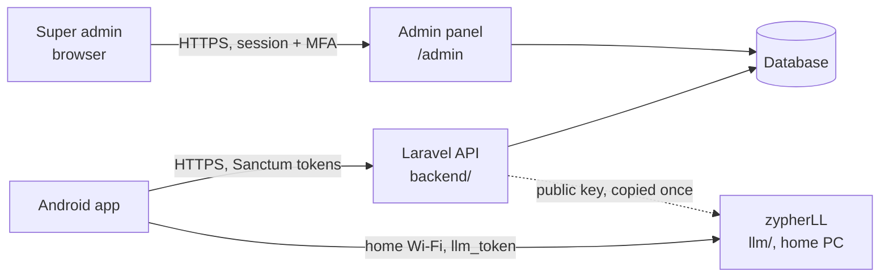

# Aster backend: Laravel API and admin panel, phased prompts for Claude Code

This plan builds the Laravel side of Aster in `aster-app/backend`, in eleven Claude Code phases. It covers the API the Android app calls and a super-admin panel with a dashboard. It reflects the backend architecture doc and the Android first-run plan as of 24 Sep 2026.

Sources: [Aster backend architecture](https://claude.ai/code/artifact/e30cef08-4983-43b6-8e96-346583bc02e6), [Aster integration spec](https://claude.ai/code/artifact/9f125718-f276-42cb-bd93-c8f45d7d2881), and the API contract in §6 of the Android plan (`android/docs/aster-first-run-plan.md`). Claude Code can't open those links, so this file copies in everything it needs from them. "Aster" is a placeholder name. Rohan, Meera and the other names are sample data.

## Contents

0. How to use this file
1. Scope, stack and folders
2. How the pieces fit
3. Data model
4. Tokens, PINs and roles
5. API contract
6. Admin panel and dashboard
7. zypherLL contract (`llm/`)
8. Phase prompts
9. Decisions to confirm
10. Final QA checklist

---

## 0. How to use this file

1. Save this file as `aster-app/backend/docs/aster-backend-plan.md`. Every prompt points at `docs/aster-backend-plan.md`, relative to `backend/`.
2. Open Claude Code in `aster-app/backend`, not in `aster-app`. Artisan, the tests and the Laravel Boost MCP server all expect to run from there.
3. Run the phases in order, one Claude Code session per phase, or clear the context between phases. The generated `CLAUDE.md` and this file carry the context forward.
4. Paste the prompt from §8 as it is. Each phase ends with checks and a report, so you can review and commit before starting the next one.
5. Phases 0–6 build the API the Android app needs. Phases 7–9 build the admin panel and dashboard. Phase 10 prepares production.
6. For the bigger phases (3, 4, 5, 8 and 9), you can ask Claude Code to show its plan before it writes code.
7. After Phase 0 you run one interactive command yourself, `php artisan boost:install`, then restart Claude Code. Phase 0's report reminds you.

Laravel Boost rewrites `CLAUDE.md` each time you run `boost:install` or `boost:update`, so hand edits there get lost. Project rules therefore live in `.ai/guidelines/aster.md`, which Boost copies into `CLAUDE.md`. To change a rule, edit that file and run `php artisan boost:update`, or `boost:install` again if the change doesn't appear in `CLAUDE.md`.

Have these on your computer before Phase 0:

| Tool | Version | Why |
|---|---|---|
| PHP | 8.3 or newer, with openssl, pdo_sqlite, pdo_mysql, mbstring, intl and zip | Laravel 13 needs PHP 8.3 |
| Composer | 2.x | Packages |
| Laravel installer | Optional | `laravel new` with Pest; Composer alone also works |
| MySQL | 8.x | Production database, and one test run in Phase 10. Local dev and tests use SQLite. |
| Git | Any | A commit after every phase |

Fill these in `backend/.env` when Phase 0 asks for them:

| Key | Example | Used for |
|---|---|---|
| `APP_URL` | `http://localhost:8000` locally, `https://aster.yourdomain.com` in production | Links and the admin panel |
| `ASTER_REGISTRATION` | `open` | `open`: any household can sign up. `single`: sign-up closes once the first household exists. |
| `ASTER_ADMIN_EMAIL` | `you@example.com` | The first super admin, created in Phase 7 |
| `ASTER_ADMIN_TIMEZONE` | `Asia/Kolkata` | Day boundaries on the dashboard and the location day picker |
| `ASTER_ADMIN_ALLOWED_IPS` | Empty, or `203.0.113.4,198.51.100.7` | Optional IP allowlist for `/admin`. Empty allows all. |
| `ASTER_JWT_PRIVATE_KEY` | `storage/keys/aster-jwt.key` (default) | Signs llm_tokens. Never leaves the server. |
| `ASTER_JWT_PUBLIC_KEY` | `storage/keys/aster-jwt.pub` (default) | Copied to each home PC for zypherLL |
| `ASTER_JWT_ISSUER` | `aster` (default) | Must match zypherLL's issuer check |
| `ASTER_TOKEN_HOURS` | `12` (default) | Profile token and llm_token lifetime |

---

## 1. Scope, stack and folders

### In scope
- Every Laravel endpoint the Android app calls (§5): household accounts and devices, profiles and PIN unlock, the llm_token, chat history, sync, the home place, locations, settings, VIP contacts, reminders and the activity log.
- Scheduled jobs that prune old data.
- A super-admin panel at `/admin` (§6). It shows every household's details, with chat text and location trails behind an audited Show action. It also has suspend and revoke actions and a dashboard.
- Production setup (Phase 10).

### Out of scope
- The Android app in `android/`, which has its own plan, and zypherLL in `llm/`. The one change `llm/` needs, checking the new `aud` claim, is a separate prompt in §7.
- Assistant memory and captured WhatsApp, Google Chat and SMS messages. They never reach Laravel, so neither the API nor the admin panel can show them.

### Stack
- **Laravel 13** on PHP 8.3+. It was released on 17 Mar 2026 and gets security fixes until 17 Mar 2028.
- **Laravel Sanctum** for device and profile tokens, and **firebase/php-jwt** for the RS256 llm_token.
- **Filament 5** for the admin panel (Livewire-based, PHP 8.2+, Laravel 11.28+). A default panel needs no npm build.
- **Pest** for tests, **Larastan** at level 5 for static analysis, and **Pint** for code style.
- **Laravel Boost**, dev only. Its MCP server and guidelines give Claude Code docs for the installed Laravel, Filament and Pest versions, plus the database schema, logs and last error.
- **SQLite** for local dev and tests, **MySQL 8** in production. Keep queries portable: no raw MySQL-only SQL and no SQL date functions.
- No queue worker. Cron runs the scheduler.
- Optional: **Scramble** (`dedoc/scramble`) for OpenAPI docs in Phase 6, if it supports the installed Laravel version.

### Folders
```text
aster-app/
├── android/                    React Native app (plan: android/docs/aster-first-run-plan.md)
├── llm/                        zypherLL (FastAPI, Zephyr 7B)
└── backend/                    this plan
    ├── .ai/guidelines/aster.md project rules; Boost copies them into CLAUDE.md
    ├── app/
    │   ├── Console/Commands/   aster:jwt-keys, aster:create-admin, aster:prune
    │   ├── Enums/              13 backed enums (§3)
    │   ├── Filament/           Resources/, Pages/, Widgets/ for the admin panel
    │   ├── Http/Controllers/Api/  14 controllers, one per area (§5)
    │   ├── Http/Middleware/    EnsureDeviceToken, EnsureProfileToken, EnsureOwner,
    │   │                       EnsureNotGuest, AdminIpAllowlist
    │   ├── Http/Requests/      one form request per write endpoint
    │   ├── Http/Resources/     API resources (§5)
    │   ├── Models/             16 models (§3)
    │   ├── Policies/
    │   └── Services/           LlmTokenIssuer, PinGuard, DeviceTracker, AuthEvents,
    │                           SyncService, AdminAudit, Metrics
    ├── bootstrap/app.php       middleware aliases, JSON errors for /api
    ├── config/aster.php
    ├── database/               migrations, factories, seeders (DemoSeeder)
    ├── routes/api.php          route groups by token type (§5)
    ├── routes/console.php      the daily schedule
    ├── storage/keys/           aster-jwt.key and aster-jwt.pub (git-ignored)
    ├── tests/Feature/Api/      one file per controller, plus the contract test
    ├── tests/Feature/Admin/    panel, resources and widgets
    ├── tests/Fixtures/jwt/     a test-only key pair and sample token for llm/
    └── docs/aster-backend-plan.md
```

---

## 2. How the pieces fit

The phone is the hub. It talks to Laravel over HTTPS from anywhere, and to zypherLL only on home Wi-Fi. Laravel never calls zypherLL. The admin panel is part of the same Laravel app, with its own login.



- **Laravel stores** household accounts, profiles and PIN hashes, devices, chat history (encrypted), reminders, VIP contacts and alert settings, the home place, location history and the activity log. New in this plan: auth events, device activity days, admins and the admin audit log.
- **Laravel never stores** assistant memory (on each home PC), captured messages (on the phone), private and Guest chats (never uploaded) or the zypherLL admin key.
- **Many households share one Laravel install.** Each household runs its own zypherLL. Laravel signs every llm_token with one private key, and the `aud` claim ties each token to one household (§4, §7).
- **A household id** is `"h"` followed by `users.id`, for example `h7`. It appears in API responses, on the admin panel and in each home PC's `.env`.

---

## 3. Data model

Sixteen tables. Every household-owned row traces back to one `users` row: the household account, which is the Owner's login. Rows and columns marked *new* are not in the architecture doc.

| Table | Columns | Notes |
|---|---|---|
| `users` | id, name, email (unique), password, suspended_at (nullable) *new*, suspension_reason (nullable) *new*, remember_token, timestamps | One row per household. Uses `HasApiTokens` for device tokens. |
| `profiles` | id, user_id, name (max 40), color (`#RRGGBB`), role (owner, member, restricted, guest), pin_hash (nullable; only Guest has none), personality (text, nullable), web_mode (auto, never; default auto), memory_enabled (default true), sampling (auto, precise, balanced, creative; default auto), max_tokens (nullable), auto_lock_minutes (nullable), last_unlocked_at (nullable) *new*, timestamps, soft deletes | Uses `HasApiTokens` for profile tokens. `pin_hash` is hidden. One Owner and one Guest per household. |
| `devices` | id, user_id, name, app_version (nullable), last_seen_at (nullable), signed_out_at (nullable) *new*, timestamps | One row per phone sign-in |
| `conversations` | id, profile_id, client_uuid (unique), title (max 120), last_message_at (nullable), timestamps, soft deletes | Deleting removes the messages at once and keeps this row as a tombstone for sync |
| `chat_messages` | id, conversation_id (cascade), client_uuid (unique), role (user, assistant), content (text, `encrypted` cast), sent_at *new*, finish_reason (stop, length, cancelled, error; nullable), memory_id (nullable), live (bool), cited (bool), sources (json), recalled (int, nullable), sampling (nullable), usage (json), seconds (decimal 8,2, nullable), rating (good, bad; nullable), context (json), timestamps | Mirrors zypherLL's response fields. `context` holds flags about what the app added to the prompt, never message text. Indexes: (conversation_id, id), (created_at). |
| `places` | id, user_id, name, address, lat and lng (decimal 10,7), radius_m (default 150), wifi_ssid (nullable), llm_url (nullable), timestamps | Unique (user_id, name). Home is the row named `Home`. |
| `locations` | id, user_id, device_id, client_uuid (unique) *new*, lat, lng, accuracy_m (nullable), event (periodic, arrived, left), place_id (nullable), recorded_at, created_at | Index (user_id, recorded_at) |
| `location_settings` | id, user_id (unique), enabled (default true), interval_minutes (default 15), retention_days (default 30), share_area (default false), paused_until (nullable) *new*, timestamps | Created with the household |
| `vip_contacts` | id, user_id, name, match_key, sources (json: whatsapp, google_chat, sms), enabled, timestamps, soft deletes | `match_key` is the sender name as it appears in notifications |
| `alert_settings` | id, user_id (unique), enabled, missed_after_minutes (default 10), speak_mode (full, name, summary), quiet_start and quiet_end (time, nullable), urgent_keywords (json), headphones_only, only_at_home, timestamps | Created with the household |
| `reminders` | id, profile_id, client_uuid (unique), title (max 200), due_at (nullable), trigger (time, arrive_home), status (pending, done, cancelled), timestamps, soft deletes | The phone schedules the alarm |
| `activity_logs` | id, user_id *new*, profile_id (nullable), device_id (nullable), client_uuid (unique) *new*, type, summary, meta (json), occurred_at, created_at | Sent by the phone. Indexes: (user_id, occurred_at), (type, occurred_at). |
| `auth_events` *new* | id, user_id (nullable), profile_id (nullable), device_id (nullable), type, ip, created_at | Written by the server. Indexes: (type, created_at), (user_id, created_at). |
| `device_activity_days` *new* | id, user_id, device_id, day (date) | One row per device per day it called the API. `day` is the date in `ASTER_ADMIN_TIMEZONE`. Unique (device_id, day); index (day). |
| `admins` *new* | id, name, email (unique), password, app_authentication_secret (text, nullable), app_authentication_recovery_codes (text, nullable), is_active (default true), last_login_at (nullable), remember_token, timestamps | Super admins, separate from `users` |
| `admin_audit_logs` *new* | id, admin_id, action, user_id (the household, nullable), subject_type and subject_id (nullable), meta (json), ip, user_agent, created_at | Indexes: (user_id, created_at), (admin_id, created_at) |

Laravel's own tables stay too: `personal_access_tokens` (Sanctum, polymorphic), `sessions` (admin logins), `cache`, `jobs` and `password_reset_tokens`.

### Enums (`app/Enums`, backed by strings)

| Enum | Values |
|---|---|
| ProfileRole | owner, member, restricted, guest. `allowsWeb()` is true for owner and member. |
| WebMode | auto, never |
| Sampling | auto, precise, balanced, creative |
| MessageRole | user, assistant |
| FinishReason | stop, length, cancelled, error |
| Rating | good, bad |
| SpeakMode | full, name, summary |
| MessageSource | whatsapp, google_chat, sms |
| LocationEvent | periodic, arrived, left |
| ReminderTrigger | time, arrive_home |
| ReminderStatus | pending, done, cancelled |
| ActivityType | spoken_alert, reminder_fired, arrived_home, left_home, server_problem, reply_sent. The column stays a plain string (lowercase letters and underscores, max 40), so a newer app can send new types. |
| AuthEventType | register, login, login_failed, logout, unlock, unlock_failed, lockout, guest_session |

### Retention

One command, `php artisan aster:prune`, runs daily at 02:30 server time:

| Data | Kept for |
|---|---|
| `locations` | Each household's `retention_days` (default 30) |
| `activity_logs` and `auth_events` | 90 days |
| `device_activity_days` | 400 days, so charts can show a year |
| `admin_audit_logs` | 365 days |
| Soft-deleted profiles, reminders and VIP contacts, and conversation tombstones | Force-deleted after 30 days |

`sanctum:prune-expired --hours=24` runs daily as well.

---

## 4. Tokens, PINs and roles

Three credentials. The device token opens the household, the profile token opens one profile's data, and the llm_token opens that profile's memory on the home PC.

| Credential | What it is | Issued by | Lifetime | Sent to | Ended by |
|---|---|---|---|---|---|
| Device token | Sanctum token on `User`, named `device:{device_id}`, ability `device` | `/auth/register`, `/auth/login` | No expiry | Laravel | `/auth/logout`, an admin revoke, suspension |
| Profile token | Sanctum token on `Profile`, named `device:{device_id}`, ability `profile` | `/profiles/{id}/unlock`, `/guest-sessions` | 12 hours | Laravel | `/profiles/{id}/lock`, expiry, profile deletion, suspension |
| llm_token | RS256 JWT | Unlock, guest session, `/llm-token` | 12 hours, never past the profile token's expiry | zypherLL | Expiry only, because zypherLL checks it offline |

Both Sanctum token types carry the device id in their name. That lets every request update the device's `last_seen_at` and today's `device_activity_days` row. Leave Sanctum's global `expiration` unset so device tokens never expire; profile tokens get their own `expires_at`.

### llm_token claims

```php
// app/Services/LlmTokenIssuer.php
$claims = [
    'iss'    => config('aster.jwt.issuer'),                    // "aster"
    'aud'    => $profile->user->householdId(),                 // "h7" (new, see §7)
    'sub'    => 'profile:' . $profile->id,
    'scope'  => 'p' . $profile->id,                           // memory folder .memory/p12/
    'web'    => $profile->role->allowsWeb() ? $profile->web_mode->value : 'never',
    'memory' => $profile->role !== ProfileRole::Guest && $profile->memory_enabled,
    'iat'    => now()->timestamp,
    'exp'    => $expiresAt->timestamp,                        // now + 12 h, capped at the profile token's expiry
];
$token = JWT::encode($claims, $privateKey, 'RS256');
```

### Roles

| Role | `web` claim | `memory` claim | Laravel access |
|---|---|---|---|
| Owner | The profile's web_mode | The profile's memory_enabled | Everything, including Owner-only routes |
| Member | The profile's web_mode | The profile's memory_enabled | Own chats, reminders, settings and activity |
| Restricted | never | The profile's memory_enabled | Own chats, settings and activity. No reminders. |
| Guest | never | false | `/profiles/{id}/lock` and `/llm-token` only. Nothing is uploaded. |

### PINs
- Exactly 6 digits, as on the canvas and in the Android plan. Hashed with `Hash::make`. Never returned and never logged.
- Guest has no PIN and opens only through `/guest-sessions`.
- A profile changes its own PIN with `PATCH /me`, which needs `current_pin`. The Owner resets anyone's PIN with `PATCH /profiles/{id}`.

### PinGuard

PinGuard counts per profile, with Laravel's `RateLimiter` on the shared cache store.
- Wrong PINs 1–4 return 422 with `attempts_left` (4 down to 1).
- The 5th wrong PIN starts a lockout and returns 429 with `retry_after` and a `Retry-After` header. During a lockout the PIN isn't checked; every try gets 429 with the seconds left.
- The first lockout lasts 30 s, matching the app's copy. Each further lockout within 24 hours doubles it, up to 1 hour: 30 s, 1 min, 2 min, 4 min, 8 min, 16 min, 32 min, then 60 min.
- After a lockout ends, the profile gets 5 fresh tries. A right PIN clears the try count but not the lockout history.
- Every unlock, wrong PIN and lockout is written to `auth_events`.
- Someone holding the phone gets at most about 120 guesses a day once the locks reach an hour. Trying every 6-digit PIN would take about 23 years.

### Middleware (aliases in `bootstrap/app.php`)

| Alias | Class | Checks |
|---|---|---|
| `device` | EnsureDeviceToken | The token belongs to a `User` and has the `device` ability; the household isn't suspended |
| `profile` | EnsureProfileToken | The token belongs to a `Profile` that isn't deleted and has the `profile` ability; the household isn't suspended |
| `owner` | EnsureOwner | The profile's role is owner |
| `not-guest` | EnsureNotGuest | The profile's role isn't guest |

- `auth:sanctum` resolves either model, because Sanctum's token table is polymorphic and its guard has no provider set.
- A suspended household gets 403 `{"message": "This account is suspended."}` on every route, including login.
- Route bindings look rows up through the token, so another household's or profile's id returns 404. `{conversation}`, `{message}` and `{reminder}` resolve through the token's profile. `{profile}` and `{vip_contact}` resolve through the token's household.

---

## 5. API contract

This contract is the single source of truth for Laravel and the Android app. It confirms the assumptions listed in §6 of the Android plan: login and register return `token`; unlock returns `profile_token`, `llm_token` and `expires_at`; `GET /places/home` returns 404 when there is no home yet; colours are hex; the app's `auto_lock_minutes` of 2 or null is valid. Fields added here, such as `household_id`, are extras the app can ignore.

### Conventions
- The base URL is `{APP_URL}/api`, with JSON in and out. Clients send `Accept: application/json` and `Authorization: Bearer <token>`. The app may also send `X-App-Version`, which is stored on the device row.
- Times are ISO 8601 in UTC with a `Z`, for example `2026-09-24T10:15:00Z`. Dates are `YYYY-MM-DD`.
- ids are integers. `client_uuid` is a UUID the phone makes; it makes every upload safe to retry.
- Single resources and lists are wrapped in `data` (Laravel API resources). Action endpoints (auth, sessions, batches) return flat objects.
- Errors use Laravel's shapes. 422 is `{ message, errors: { field: [..] } }`. 401 is `{ "message": "Unauthenticated." }`. 403 and 404 are `{ message }`. 429 is `{ message, retry_after }` with a `Retry-After` header.
- `GET /up` is Laravel's health route. The app uses it for its server check.
- Rate limits: `auth` allows 10 a minute per IP and email; `api` allows 120 a minute per token; `batch` allows 30 a minute per device. PinGuard handles unlock.

### Endpoints

Token column: **none**; **device**; **profile** (any unlocked profile, Guest included); **profile, not Guest**; **Owner**.

**Household accounts**

| Method | Path | Token | Request | Success | Errors |
|---|---|---|---|---|---|
| POST | `/auth/register` | none | name, email, password (min 8), device_name, app_version? | 201 `{ token, household_id, user: {id, name, email}, device: {id, name} }` | 403 "Registration is closed." in single mode; 422 |
| POST | `/auth/login` | none | email, password, device_name, app_version? | 200, same shape as register | 422 "Email or password is wrong."; 403 suspended; 429 |
| POST | `/auth/logout` | device | none | 204 | none |

**Profiles and sessions**

| Method | Path | Token | Request | Success | Errors |
|---|---|---|---|---|---|
| GET | `/profiles` | device | none | 200 `{ data: [{ id, name, color, role }] }`, Guest included | none |
| POST | `/profiles` | device for the first profile, Owner after that | name, color, role (owner, member, restricted), pin, personality?, web_mode?, memory_enabled?, sampling?, max_tokens?, auto_lock_minutes? | 201 `{ data: Profile }` | 403 a device token once a profile exists; 422, including "The first profile must be the Owner." |
| PATCH | `/profiles/{id}` | Owner | Any Profile field; role between member and restricted; pin | 200 `{ data: Profile }` | 422 when changing the Owner's or Guest's role |
| DELETE | `/profiles/{id}` | Owner | none | 204 (soft delete; the profile's tokens are revoked) | 422 for the Owner or Guest |
| POST | `/profiles/{id}/unlock` | device | pin | 200 `{ profile_token, llm_token, expires_at, household_id, profile }` | 422 wrong PIN with `attempts_left`; 429 with `retry_after`; 422 for the Guest profile |
| POST | `/profiles/{id}/lock` | profile | none | 204 | 403 when `{id}` isn't the token's profile |
| POST | `/llm-token` | profile | none | 200 `{ llm_token, expires_at }` | none |
| POST | `/guest-sessions` | device | none | 200, same shape as unlock, for the Guest profile | none |
| GET | `/me` | profile, not Guest | none | 200 `{ data: Profile }` | none |
| PATCH | `/me` | profile, not Guest | name?, color?, personality?, web_mode?, memory_enabled?, sampling?, max_tokens?, auto_lock_minutes?, pin with current_pin | 200 `{ data: Profile }` | 422 wrong current_pin |
| GET | `/sync?since=` | profile, not Guest | none | 200, see Sync response | none |

**Chats**

| Method | Path | Token | Request | Success | Errors |
|---|---|---|---|---|---|
| GET | `/conversations?since=&cursor=` | profile, not Guest | none | 200 `{ data: [Conversation], deleted: [ids], meta: { next_cursor } }`; `deleted` only when `since` is given | none |
| POST | `/conversations` | profile, not Guest | client_uuid, title | 201 when new, 200 when the client_uuid exists: `{ data: Conversation }` | 422 |
| DELETE | `/conversations/{id}` | profile, not Guest | none | 204 | 404 |
| GET | `/conversations/{id}/messages?after=&limit=` | profile, not Guest | none | 200 `{ data: [Message], meta: { has_more } }`; limit up to 100, default 50 | 404 |
| POST | `/conversations/{id}/messages` | profile, not Guest | messages: 1–50 items with the Message fields below | 200 `{ data: [{ id, client_uuid }] }` | 404; 422 |
| PATCH | `/chat-messages/{id}` | profile, not Guest | rating (good, bad or null), content, finish_reason | 200 `{ data: Message }` | 404; 422 |

**Home, locations and settings**

| Method | Path | Token | Request | Success | Errors |
|---|---|---|---|---|---|
| GET | `/places/home` | Owner | none | 200 `{ data: Place }` | 404 when no home is saved |
| PUT | `/places/home` | Owner | name ("Home"), address, lat, lng, radius_m (50–1000), wifi_ssid?, llm_url? (http or https URL) | 200 `{ data: Place }` | 422 |
| POST | `/locations/batch` | device | points: 1–500 items of { client_uuid, lat, lng, accuracy_m?, event, place_id?, recorded_at } | 200 `{ accepted, duplicates, discarded }`; points are discarded while tracking is off or paused | 422 |
| GET | `/locations?date=&tz=` | Owner | none | 200 `{ data: [Point], meta: { date, tz, count } }`; `tz` is an IANA name, default UTC | 422 |
| GET, PUT | `/location-settings` | Owner | enabled, interval_minutes (15–120), retention_days (1–90), share_area, paused_until | 200 `{ data }` | 422 |
| GET, PUT | `/alert-settings` | Owner | enabled, missed_after_minutes (1–120), speak_mode, quiet_start and quiet_end (HH:MM), urgent_keywords (up to 20, each up to 40 characters), headphones_only, only_at_home | 200 `{ data }` | 422 |
| GET, POST, PATCH, DELETE | `/vip-contacts` | Owner | name (max 60), match_key (max 120), sources (at least one MessageSource), enabled | `{ data }`; POST 201; DELETE 204 | 422 |

**Reminders and activity**

| Method | Path | Token | Request | Success | Errors |
|---|---|---|---|---|---|
| GET, POST, PATCH, DELETE | `/reminders` | profile, not Guest | client_uuid, title, trigger, due_at (required when trigger is time), status | `{ data }`; POST 201 when new, 200 when the client_uuid exists; DELETE 204 | 403 for Restricted; 422 |
| POST | `/activity/batch` | device | events: 1–500 items of { client_uuid, profile_id?, type, summary (max 200), meta? (up to 2 KB), occurred_at } | 200 `{ accepted, duplicates }` | 422 when a profile_id isn't in the household |
| GET | `/activity?cursor=` | profile, not Guest | none | 200 `{ data: [Activity], meta: { next_cursor } }`. Each profile sees its own events; the Owner also sees device events, which have no profile. | none |

### Resource shapes

| Resource | Fields |
|---|---|
| Profile | id, name, color, role, has_pin, personality, web_mode, memory_enabled, sampling, max_tokens, auto_lock_minutes, created_at, updated_at |
| Conversation | id, client_uuid, profile_id, title, last_message_at, message_count, created_at, updated_at |
| Message | id, client_uuid, role, content (max 50,000 characters), sent_at, finish_reason, memory_id, live, cited, sources (up to 20 items), recalled, sampling, usage, seconds, rating, context (up to 20 flags), created_at |
| Place | id, name, address, lat, lng, radius_m, wifi_ssid, llm_url, updated_at |
| Point | id, lat, lng, accuracy_m, event, place_id, recorded_at |
| Reminder | id, client_uuid, title, due_at, trigger, status, created_at, updated_at |
| VipContact | id, name, match_key, sources, enabled, updated_at |
| Activity | id, profile_id, device_id, type, summary, meta, occurred_at |

Value rules: `color` is `#RRGGBB` (the app offers Mint `#7FD9B8`, Lilac `#C7AFF5`, Sky `#82C7F0` and Peach `#F4B390`; Guest gets `#9299A1`). `auto_lock_minutes` is 1–60 or null. `max_tokens` is 16–8192 or null. `personality` is up to 2,000 characters.

### Examples

Unlock:
```json
{
  "profile_token": "41|p2Xh…",
  "llm_token": "eyJhbGciOiJSUzI1NiIs…",
  "expires_at": "2026-09-24T22:15:00Z",
  "household_id": "h7",
  "profile": { "id": 12, "name": "Rohan", "color": "#7FD9B8", "role": "owner", "has_pin": true }
}
```

Wrong PIN, then lockout:
```json
{ "message": "Wrong PIN.", "errors": { "pin": ["Wrong PIN."] }, "attempts_left": 2 }
```
```json
{ "message": "Too many wrong PINs. Try again in 30 s.", "retry_after": 30 }
```

Sync response:
```json
{
  "server_time": "2026-09-24T10:15:00Z",
  "household_id": "h7",
  "me": { "id": 12, "name": "Rohan", "role": "owner" },
  "profiles": [{ "id": 13, "name": "Meera", "color": "#C7AFF5", "role": "member" }],
  "home": { "id": 3, "name": "Home", "radius_m": 150 },
  "location_settings": { "enabled": true, "interval_minutes": 15 },
  "alert_settings": { "enabled": true, "speak_mode": "full" },
  "vip_contacts": [],
  "reminders": [],
  "deleted": { "profiles": [], "reminders": [], "vip_contacts": [] }
}
```
- Without `since`, sync returns everything. With `since`, it returns rows changed after it plus deleted ids. The app sends the last `server_time` as the next `since`, so the phone's clock never matters.
- Every profile gets the home place, VIP contacts and alert settings, because the phone's home detection and alert engine need them. The app shows those screens to the Owner only.
- `reminders` holds only the token's profile's reminders.

### Route file

```php
// routes/api.php (Laravel adds the /api prefix)
Route::middleware('throttle:auth')->group(function () {
    Route::post('auth/register', [AuthController::class, 'register']);
    Route::post('auth/login', [AuthController::class, 'login']);
});

Route::middleware(['auth:sanctum', 'throttle:api'])->group(function () {
    // A device token may create only the first profile; after that the Owner (ProfilePolicy)
    Route::post('profiles', [ProfileController::class, 'store']);

    Route::middleware('device')->group(function () {
        Route::post('auth/logout', [AuthController::class, 'logout']);
        Route::get('profiles', [ProfileController::class, 'index']);
        Route::post('profiles/{profile}/unlock', [SessionController::class, 'unlock']);
        Route::post('guest-sessions', [SessionController::class, 'guest']);
        Route::post('locations/batch', [LocationController::class, 'batch'])->middleware('throttle:batch');
        Route::post('activity/batch', [ActivityController::class, 'batch'])->middleware('throttle:batch');
    });

    Route::middleware('profile')->group(function () {
        Route::post('profiles/{profile}/lock', [SessionController::class, 'lock']);
        Route::post('llm-token', [SessionController::class, 'llmToken']);

        Route::middleware('not-guest')->group(function () {
            Route::get('me', [MeController::class, 'show']);
            Route::patch('me', [MeController::class, 'update']);
            Route::get('sync', SyncController::class);
            Route::apiResource('conversations', ConversationController::class)->only(['index', 'store', 'destroy']);
            Route::get('conversations/{conversation}/messages', [ChatMessageController::class, 'index']);
            Route::post('conversations/{conversation}/messages', [ChatMessageController::class, 'store']);
            Route::patch('chat-messages/{message}', [ChatMessageController::class, 'update']);
            Route::apiResource('reminders', ReminderController::class)->except('show');
            Route::get('activity', [ActivityController::class, 'index']);

            Route::middleware('owner')->group(function () {
                Route::apiResource('profiles', ProfileController::class)->only(['update', 'destroy']);
                Route::get('places/home', [PlaceController::class, 'show']);
                Route::put('places/home', [PlaceController::class, 'update']);
                Route::get('locations', [LocationController::class, 'index']);
                Route::get('location-settings', [LocationSettingController::class, 'show']);
                Route::put('location-settings', [LocationSettingController::class, 'update']);
                Route::get('alert-settings', [AlertSettingController::class, 'show']);
                Route::put('alert-settings', [AlertSettingController::class, 'update']);
                Route::apiResource('vip-contacts', VipContactController::class)->except('show');
            });
        });
    });
});
```

- Define all three rate limiters (`auth`, `api`, `batch`) in `AppServiceProvider` before any route uses them. An undefined named limiter throttles requests incorrectly instead of failing loudly.
- `apiResource` registers PUT next to every PATCH route (profiles, reminders, VIP contacts). Both run the same update, and the contract test in Phase 6 treats them as one route.

---

## 6. Admin panel and dashboard

A Filament 5 panel at `/admin`, for super admins only. It shows every household's details. Chat text and location trails sit behind a Show action that writes an audit entry. A dashboard shows totals across all households.

### Access and security
- The panel has its own `admins` table, `Admin` model, `admins` auth provider and `admin` session guard. Household accounts can't sign in to `/admin`, and an admin session can't call the API.
- `Admin` implements `FilamentUser` (`canAccessPanel()` returns `is_active`), `HasAppAuthentication` and `HasAppAuthenticationRecovery`, using Filament's `InteractsWithAppAuthentication` and `InteractsWithAppAuthenticationRecovery` traits.
- Multi-factor authentication is required:
  ```php
  // app/Providers/Filament/AdminPanelProvider.php
  ->authGuard('admin')
  ->multiFactorAuthentication([
      AppAuthentication::make()->recoverable(),
  ], isRequired: true)
  ```
  Each admin sets up an authenticator app at first sign-in and saves the recovery codes.
- There are no sign-up or password-reset pages. Admins are created only with `php artisan aster:create-admin`.
- Filament's login throttling stays on. Production uses `SESSION_LIFETIME=120` and secure cookies, and `ASTER_ADMIN_ALLOWED_IPS` can limit who reaches `/admin`.
- Never shown anywhere: `pin_hash`, token hashes, the JWT private key, MFA secrets and recovery codes.

### What the panel can show

| Data | In the panel | How |
|---|---|---|
| Household account, profiles, devices, home place, settings, VIP contacts, reminders, activity, auth events | Yes | Normal views |
| Chat text | Yes, one conversation at a time | Behind "Show messages". Each use writes an audit entry. |
| Location trail | Yes, one household and day at a time | Behind "Show locations". Each use writes an audit entry. |
| Assistant memory | No | It lives on each home PC |
| Captured WhatsApp, Google Chat and SMS messages | No | They stay on the phone (see decision 10 in §9 about answers that quote them) |
| Private and Guest chats | No | They're never uploaded |

### Navigation
1. Dashboard
2. Households
3. Devices, across all households
4. Activity, across all households, with a type filter (for example `server_problem`)
5. Security: auth events such as failed logins, failed unlocks and lockouts
6. Audit log
7. Admins

### Households list
- Columns: household id (`h7`), Owner name, email, profiles, devices, last active (the latest device `last_seen_at`), chats active in the last 30 days, status (Active or Suspended) and created.
- Search by name, email or household id. Filters: status, active in the last 7 or 30 days, and created between two dates. Default sort: last active, newest first.
- Load counts with `withCount` and eager loading, so the list runs a fixed number of queries.

### Household page
A read-only view page with ten tabs:
1. **Overview**: the account (name, email, created, status, and the household id with a copy button, for the home PC's `.env`), the home place (address, radius, Wi-Fi name, LLM address) on a small map, counts (profiles, devices, chats, messages, reminders) and the last activity.
2. **Profiles**: name, colour, role, web_mode, memory, sampling, auto-lock, last unlocked, chats, messages and deleted state.
3. **Devices**: name, app version, last seen, signed out, and days active in the last 30. Action: Revoke.
4. **Chats**: each conversation's profile, title, message count, last message and deleted state. A conversation page shows counts, ratings, average answer time and web answers. "Show messages" then reveals the thread, with sources and ratings.
5. **Reminders**: title, profile, trigger, due time and status.
6. **Locations**: the tracking settings and a day picker in `ASTER_ADMIN_TIMEZONE`. "Show locations" draws that day's points and path on a Leaflet map with OpenStreetMap tiles, marks arrivals and departures, and lists the points below. The map carries the "© OpenStreetMap contributors" credit.
7. **Alerts**: alert settings and VIP contacts.
8. **Activity**: the household's activity log, newest first, with a type filter.
9. **Security**: the household's auth events, with IP addresses.
10. **Audit**: audit entries about this household.

Header actions:
- **Suspend** asks for a reason. It sets `suspended_at` and `suspension_reason`, deletes every device and profile token, and makes the API return 403. llm_tokens already issued keep working on the home PC until they expire, at most 12 hours later, and the confirm dialog says so.
- **Unsuspend** clears both fields. The household then signs in again on each phone.

### Audit log
- `AdminAudit::record($action, $household, $subject = null, $meta = [])` writes a row to `admin_audit_logs` with the admin, IP address and user agent.
- Actions: `messages.viewed` (with the conversation id), `locations.viewed` (with the date), `household.suspended` (with the reason), `household.unsuspended`, `device.revoked`, `admin.created` and `admin.deactivated`.
- The Audit log page is read-only. Nothing in the panel edits or deletes entries.

### Dashboard
Every widget shows counts across households, never content. Results are cached for 10 minutes, and days follow `ASTER_ADMIN_TIMEZONE`.

**Row 1: stats**

| Stat | Definition |
|---|---|
| Households | `users` rows. Description: new in the last 7 days. |
| Active households | Households with a `device_activity_days` row in the last 7 days |
| Profiles | Profiles that aren't deleted, excluding Guest. Description: the count per role. |
| Devices active today | Today's `device_activity_days` rows |
| Answers today | Assistant `chat_messages` created today, with a 14-day sparkline |
| Failed unlocks, 24 h | `auth_events` of type `unlock_failed`. Description: lockouts in the same window. |
| Server problems, 24 h | `activity_logs` of type `server_problem` |

**Row 2: charts**
- Answers per day for the last 30 days (line).
- Active devices and active households per day for the last 30 days (two lines).
- New households per week for the last 12 weeks, with weeks starting on Monday (bars).

**Row 3: answer quality**, from assistant messages created in the last 30 days

| Stat | Definition |
|---|---|
| Thumbs up | good ÷ (good + bad) |
| Average answer time | Mean of `seconds` |
| Web answers | Share with at least one item in `sources` |
| Cut off | Share with finish_reason `length` |
| Finish reasons | A doughnut of stop, length, cancelled and error |

**Row 4: tables**
- The latest 20 server problems: time, household, device and summary, each linking to the household page.
- The 10 newest households.
- App versions in use: each version and the number of devices seen with it in the last 30 days.

`App\Services\Metrics` has one method per number or series. Each converts local day boundaries to UTC instants and counts with `whereBetween` on indexed columns, so the same code runs on SQLite and MySQL.

Privacy: say in your privacy policy that support staff can view chat history and location trails, and that each view is logged. The app's text saying that only the Owner can see location history needs the same update.

---

## 7. zypherLL contract (`llm/`)

Laravel and zypherLL share only a key pair and the claims in §4. Phase 3 makes the keys and a test fixture.

- **Keys.** `backend/storage/keys/aster-jwt.key` is the private key and never leaves the server. `aster-jwt.pub` is the public key: copy it to each home PC and point `ZYPHER_JWT_PUBLIC_KEY` at it. On a single dev machine, `llm/.env` can point at `../backend/storage/keys/aster-jwt.pub`.
- **Claims.** `iss` is "aster", `aud` is the household id ("h7"), `sub` is "profile:12", `scope` is "p12", `web` is "auto" or "never", `memory` is true or false, plus `iat` and `exp`.
- **Household id.** Register, login and unlock return `household_id`, and the admin panel's household page shows it. Set it once on each home PC as `ZYPHER_HOUSEHOLD_ID`.
- **The `aud` check is required.** PyJWT rejects any token that carries `aud` when `decode()` isn't given an audience. Until `llm/` has this change, every Laravel-signed token gets 401 there.
- **Fixture.** `backend/tests/Fixtures/jwt/` holds a throwaway test key pair (never the real one), a sample token for household `h1` and profile 12 that expires in 2099, and `claims.json`. zypherLL's tests can verify against it.

Prompt for Claude Code in `aster-app/llm`, once Phase 3 is done:

```text
Laravel's llm_token now carries an `aud` claim: "h" followed by the household id, for example "h7". Update zypherLL's JWT check to require it. If the caller() dependency in zypher/view/api/auth.py doesn't exist yet, build it as the integration spec describes, with this change included.

1. Add HOUSEHOLD_ID to the zypher config, read from ZYPHER_HOUSEHOLD_ID in .env (for example ZYPHER_HOUSEHOLD_ID=h7).
2. In jwt.decode, pass audience=config.HOUSEHOLD_ID and add "aud" to options["require"]. Keep algorithms=["RS256"] and issuer="aster".
3. If ZYPHER_HOUSEHOLD_ID or the public key is missing, switch the JWT path off and log why. The admin key keeps working.
4. Tests: a token for this household passes; another household's aud, a missing aud, an expired token and a wrong issuer each get 401. Use ../backend/tests/Fixtures/jwt/ (public key, sample token, claims.json) if it exists.

Checks: the tests pass, and a token from a real unlock works against /v1/chat/completions on the home PC.
Stop and report.
```

---

## 8. Phase prompts

| Phase | Builds | Result |
|---|---|---|
| 0 | Project setup | Laravel 13 with Sanctum, Pest, Larastan and the project rules |
| 1 | Database and models | 16 tables, 13 enums, factories and a demo seed |
| 2 | Household accounts and devices | Register, login, logout and the token middleware |
| 3 | Profiles, PINs and tokens | Unlock, lock, llm_token, Guest sessions and the `llm/` fixture |
| 4 | Chats and sync | Conversations, messages, `/me` and `/sync` |
| 5 | Home, locations, alerts, reminders and activity | The rest of the API, plus pruning |
| 6 | API hardening | Contract test, limits, safe errors, API docs |
| 7 | Admin panel foundation | Filament, admins with MFA, audit log |
| 8 | Household views | Every household's details, audited reveals, suspend and revoke |
| 9 | Dashboard | Stats, charts and tables |
| 10 | Production | MySQL run, deploy guide, smoke test, §10 ticked |

### Phase 0: Project setup

```text
You're starting the Laravel backend for Aster. The plan is docs/aster-backend-plan.md. Read §0, §1 and §2 now; later phases use the rest. If that file isn't there, stop and tell me.

Goal: an empty, correctly configured Laravel 13 app in this folder (aster-app/backend), with tests, static analysis and the project rules for AI agents.

1. Check that PHP is 8.3 or newer and has the extensions listed in §0. If PHP is too old, stop and tell me. List any missing extension.
2. This folder already holds docs/. Scaffold Laravel 13 in a temporary folder and move everything up, dotfiles included, keeping docs/. Use `laravel new` with Pest and no starter kit if the installer is available. Otherwise use `composer create-project laravel/laravel`, then add pestphp/pest and pestphp/pest-plugin-laravel and convert the example tests. Use SQLite locally. If aster-app/ is already a git repository, use it; otherwise run git init here.
3. Run `php artisan install:api` for Sanctum and routes/api.php, then delete the sample /user route it adds. Keep Laravel's /up health route. Remove the welcome page and its view.
4. Install firebase/php-jwt, plus larastan/larastan and laravel/boost as dev dependencies. Don't run boost:install; I'll do that.
5. Add phpstan.neon at level 5 covering app/, and these composer scripts: `test` (php artisan test), `lint` (pint --test), `stan` (phpstan analyse) and `check` (all three in turn).
6. Create config/aster.php with every ASTER_* key in §0, read from env with the defaults shown there. Add the keys to .env.example and .env. Add storage/keys/ to .gitignore.
7. Write .ai/guidelines/aster.md, at most 60 lines. Boost copies it into CLAUDE.md. Include what the backend is (one paragraph based on §2), the commands, the folder layout from §1, and these rules:
   - docs/aster-backend-plan.md is the source of truth. Report any deviation instead of making it silently. Never change the API contract (§5) or the llm_token claims (§4) without asking.
   - Every endpoint gets a form request, an API resource, a middleware or policy check, and Pest feature tests.
   - Household data is always queried through the token's household or profile.
   - Never log or return PINs, PIN hashes, tokens, passwords, chat text or coordinates. Never commit storage/keys.
   - Keep SQL portable between SQLite and MySQL.
   - Finish every phase with `composer check` passing.
8. Make the first commit.

Checks: `composer check` passes. `php artisan serve` answers GET /up with 200. `php artisan route:list` shows no /api/user route.
Stop and report: the installed versions (PHP, Laravel, Pest, Sanctum, php-jwt, Boost), anything you couldn't do, and any deviation from the plan. End with this reminder for me: "Run `php artisan boost:install` in a terminal in this folder. Choose Claude Code, with guidelines, skills and the MCP server. Then restart Claude Code before Phase 1."
```

### Phase 1: Database and models

```text
Read docs/aster-backend-plan.md §3 (data model) and the role table in §4.

Goal: every table, enum, model and factory, plus a demo seed. No endpoints yet.

1. The 13 enums in §3, in app/Enums, backed by strings. ProfileRole gets allowsWeb().
2. Migrations for the 16 tables in §3, with the columns, defaults, foreign keys, unique keys and indexes listed there. Extend Laravel's default users migration instead of adding a second one. Foreign keys cascade on delete from users and profiles, and chat_messages cascade from conversations.
3. Models with fillable fields, casts (enums, booleans, json as array, dates, and chat_messages.content as encrypted), relations, and SoftDeletes where §3 says. User and Profile use HasApiTokens, and Profile hides pin_hash. User::householdId() returns "h" followed by the id. Create Admin and AdminAuditLog as plain models for now; Phase 7 wires them into Filament.
4. When a users row is created, also create its location_settings and alert_settings rows with the defaults in §3.
5. Factories for every model, with states for each role, a suspended household and a device seen today.
6. DemoSeeder, run only when app()->isLocal(): household Rohan (rohan@example.com, password "password"); profiles Rohan (owner), Meera (member), Arjun (restricted) and Guest, with PIN 123456 for all but Guest; one device; a home place; three conversations with messages; today's location points; reminders; VIP contacts Mom and Neha; activity and auth events. Add 25 random households created over the last 90 days, with device activity days, messages and auth events, so the dashboard has data later.
7. Tests: chat content isn't stored as plain text; enum casts round-trip; client_uuid is unique on every table that has it; deleting a household cascades to its rows; settings rows are created with a household; the seeder runs on a fresh database.

Checks: `php artisan migrate:fresh --seed` works, and `composer check` passes. Show me the final schema of profiles and chat_messages.
Stop and report.
```

### Phase 2: Household accounts and devices

```text
Read docs/aster-backend-plan.md §4 (the credentials table and Middleware) and §5 (Conventions, Household accounts and the Route file).

Goal: households can register, sign in and sign out from a phone, and every later route can tell a device token from a profile token.

1. routes/api.php: copy the route file from §5. Comment out the routes whose controllers don't exist yet; later phases uncomment them.
2. Rate limiters auth, api and batch in AppServiceProvider, with the limits in §5. Every /api response, errors included, is JSON, and 429 bodies carry retry_after.
3. AuthController: register, login and logout, with form requests and the shapes in §5. Register honours config('aster.registration'): in single mode it returns 403 "Registration is closed." once any household exists. Register and login both create a devices row (device_name, app_version) and a Sanctum token on the User named "device:{device_id}" with the ability "device", returned as `token` together with household_id, user and device. Logout deletes that token and sets signed_out_at.
4. Middleware EnsureDeviceToken, EnsureProfileToken, EnsureOwner and EnsureNotGuest, with the aliases and checks in §4, registered in bootstrap/app.php. The wrong token type gets 403. A suspended household gets 403 "This account is suspended." everywhere, login included.
5. DeviceTracker, called by the device and profile middleware. It reads the device id from the token name, updates last_seen_at at most once a minute, records today's device_activity_days row (the day in ASTER_ADMIN_TIMEZONE) at most once a day, and stores X-App-Version when it's sent. Use the cache so repeat requests don't write.
6. AuthEvents: write register, login, login_failed and logout to auth_events with the IP address.
7. Tests: register in open and single modes, and with a duplicate email; login with a wrong password (422), for a suspended household (403) and over the limit (429); logout revokes only that device's token; each middleware refuses the wrong token type with 403 (use test-only routes); last_seen_at and device_activity_days are each written once; auth events are recorded; no response contains a password or token hash.

Checks: `composer check` passes. With php artisan serve, run register, login and logout with curl and show me the responses, with tokens masked.
Stop and report.
```

### Phase 3: Profiles, PINs and tokens

```text
Read docs/aster-backend-plan.md §4 in full, the Profiles and sessions table and the Examples in §5, and §7.

Goal: profiles with PINs, unlock and lock, the llm_token and Guest sessions, exactly as §4 describes.

1. `php artisan aster:jwt-keys`: makes a 2048-bit RSA key pair at the paths in config/aster.php with openssl_pkey_new, refuses to overwrite without --force, and sets the private key file to 0600 where the OS allows it. Run it for local dev.
2. ProfileController (index, store, update, destroy) with a ProfilePolicy. A device token may create only the first profile, which must be the Owner; after that, only the Owner may create, edit or delete. Creating the Owner also creates the household's Guest profile (no PIN, colour #9299A1). Keep one Owner and one Guest per household, allow role changes only between member and restricted, and refuse to delete the Owner or Guest. Deleting a profile soft-deletes it and revokes its tokens. PINs are exactly 6 digits, hashed with Hash::make. Use a summary resource for the device-token list and ProfileResource everywhere else.
3. A route binding for {profile} that looks it up through the token's household, so another household's profile is 404.
4. PinGuard exactly as §4 describes: the 422 and 429 shapes from §5's examples, the doubling lockouts, and auth events for unlock, unlock_failed and lockout.
5. LlmTokenIssuer with the claims in §4, aud included. expires_at is 12 hours from now, capped at the current profile token's expiry when refreshing.
6. SessionController:
   - unlock: a profile token named "device:{device_id}" with the ability "profile" and a 12-hour expiry, plus llm_token, expires_at, household_id and profile; sets last_unlocked_at; returns 422 for the Guest profile, which opens only through guest;
   - lock: deletes the current profile token, and returns 403 for another profile's id;
   - llmToken: a fresh llm_token;
   - guest: the Guest profile's tokens, with web never and memory false, and a guest_session auth event.
7. MeController show and update, including a PIN change with current_pin. Guest tokens reach only lock and llm-token.
8. The llm/ fixture from §7 in tests/Fixtures/jwt/, made by a test helper so it can be rebuilt. Use a throwaway key pair, never storage/keys.
9. Tests: the claims for every row of the role table; a token decodes with the public key and carries every claim in §4; a refreshed llm_token never outlives the profile token; the lockout sequence (wrong PINs 1–4 give 422 with attempts_left 4 down to 1, the 5th gives 429 with 30 s, the next lockout lasts 60 s, and a right PIN clears the tries); another household's profile is 404; the Owner's and Guest's roles can't change; Guest gets 403 on /me; lock revokes only that profile token; no response contains pin_hash.

Checks: `composer check` passes. With curl: register, create the Owner, then unlock. Decode the llm_token locally with a PHP one-liner and the public key, and show me the claims. Don't paste tokens into websites.
Stop and report, and remind me to run the llm/ prompt in §7.
```

### Phase 4: Chats and sync

```text
Read docs/aster-backend-plan.md §3 (conversations and chat_messages) and §5 (Chats, Resource shapes and the Sync response).

Goal: the phone can upload finished exchanges safely, read its history and sync in one call.

1. Route bindings for {conversation}, {message} and {reminder} that look rows up through the token's profile, so another profile's id is 404.
2. ConversationController: index (changed since `since`, newest first, cursor pagination, plus deleted ids when `since` is given); store (idempotent by client_uuid: 201 when new, 200 when it exists); destroy (deletes the messages now and soft-deletes the conversation as a tombstone).
3. ChatMessageController: index (after, limit up to 100, has_more); store (1–50 messages, upserted by client_uuid in one transaction, returning ids and moving last_message_at to the newest sent_at); update (rating, continued content, finish_reason).
4. ConversationResource and MessageResource with the fields in §5. The cast encrypts content at rest; never log it.
5. SyncController with a SyncService. Without `since` it returns everything; with `since`, rows changed after it plus deleted ids for profiles, reminders and VIP contacts. server_time comes from the server clock. Return the parts listed in §5, with only the token's profile's reminders.
6. Tests: a retried upload stores one row per client_uuid and returns the same ids; another profile's conversation and messages are 404; the database never holds plain chat text; deleting a conversation removes its messages and lists its id in `deleted`; sync with and without `since`; sync never returns another household's rows; Guest gets 403 on every route in this phase.

Checks: `composer check` passes. With curl, upload the same batch twice and show me that the ids match.
Stop and report.
```

### Phase 5: Home, locations, alerts, reminders and activity

```text
Read docs/aster-backend-plan.md §3 (places through activity_logs, and Retention) and §5 (Home, locations and settings; Reminders and activity).

Goal: the rest of the API, and the daily pruning.

1. PlaceController: show and update the household's Home place (404 when there is none), with the validation in §5.
2. LocationController: batch (device token; 1–500 points; skips known client_uuid values; discards points while tracking is off or paused_until is in the future; place_id must belong to the household) and index (Owner; one day in the requested IANA timezone, ordered by recorded_at).
3. LocationSettingController and AlertSettingController: the Owner reads and updates the household's single row.
4. VipContactController for the Owner, with soft deletes.
5. ReminderController: Restricted gets 403 (Guest is already refused); store is idempotent by client_uuid; due_at is required when trigger is time; soft deletes.
6. ActivityController: batch (device token; 1–500 events; profile_id must belong to the household; user_id comes from the device; skips known client_uuid values) and index (the profile's own events, plus device events for the Owner, with cursor pagination).
7. `php artisan aster:prune`, applying every rule in §3's Retention table, scheduled daily at 02:30 in routes/console.php together with `sanctum:prune-expired --hours=24`.
8. Tests: each endpoint's success path, validation and role limits; batches are idempotent; points are discarded while tracking is off; a point at 23:30 in Asia/Kolkata lands on that local date; pruning removes exactly what §3 says and nothing newer.

Checks: `composer check` passes, and `php artisan schedule:list` shows both jobs.
Stop and report.
```

### Phase 6: API hardening

```text
Read docs/aster-backend-plan.md §4 and §5 in full.

Goal: the API matches §5 exactly, fails safely and is documented for the Android app.

1. A contract test: a Pest dataset with every route in §5 (method, path, token type) and each role's result (allowed, 401, 403 or 404, as §4 and §5 say). It fails if routes/api.php has a route §5 doesn't list, or the other way round.
2. Tests for the shapes the Android plan relies on: `token` from register and login; profile_token, llm_token and expires_at from unlock; 404 from GET /places/home when there's no home; hex colours; auto_lock_minutes of 2 or null.
3. Limits: the batch sizes, string lengths and message size in §5; a middleware that answers 413 when Content-Length is over 1 MB; tests that the three rate limiters behave as §5 says.
4. Errors: every /api error is JSON; a missing model gives {"message": "Not found."}; 500s show no details when APP_DEBUG is false.
5. Logging: search the code for Log:: and logger( calls, and remove anything that could write PINs, tokens, passwords, chat text or coordinates.
6. HTTPS: force https URLs when APP_ENV is production, and trust the proxy headers the host needs.
7. API docs (optional): add dedoc/scramble if it supports the installed Laravel version, serve /docs/api only locally, and export docs/openapi.json for the Android side. If it doesn't install cleanly, skip it and tell me.

Checks: `composer check` passes, contract test included.
Stop and report every difference you found between the code and §5, and how you resolved it.
```

### Phase 7: Admin panel foundation

```text
Read docs/aster-backend-plan.md §6: Access and security, Navigation and Audit log.

Goal: a Filament 5 panel at /admin that only active super admins with MFA can use, with the audit log in place.

1. Install Filament 5: `composer require filament/filament:"^5.0"` (in Windows PowerShell, use "~5.0" if the caret is dropped), then `php artisan filament:install --panels` with panel id admin and path admin. Add pestphp/pest-plugin-livewire as a dev dependency for panel tests.
2. Auth: an "admins" provider for App\Models\Admin and an "admin" session guard in config/auth.php, and ->authGuard('admin') on the panel. Admin implements FilamentUser (canAccessPanel returns is_active), HasAppAuthentication and HasAppAuthenticationRecovery, with Filament's traits.
3. Required MFA exactly as §6 shows. No registration or password-reset pages. Brand name "Aster Admin".
4. AdminIpAllowlist middleware on the panel for ASTER_ADMIN_ALLOWED_IPS (empty allows everyone), and last_login_at updated at sign-in.
5. `php artisan aster:create-admin {email} {--name=}`: asks for the password without echoing it, creates the admin and writes admin.created to the audit log. Create one for ASTER_ADMIN_EMAIL locally.
6. AdminAudit::record() as §6 describes, and a read-only Audit log resource with filters for admin, action, household and date.
7. An Admins resource: list, deactivate (writes admin.deactivated) and reactivate. Admins can't deactivate themselves, and new admins come only from the command.
8. An Admin factory state with MFA already set up, so panel tests can act as a ready admin.
9. Tests: a household account and a profile token can't reach /admin; an inactive admin can't sign in; an admin without MFA is sent to MFA setup before the dashboard; audit rows record the admin, action, IP address and user agent; the audit log has no edit or delete actions.

Checks: `composer check` passes. I can sign in at {APP_URL}/admin with the admin you created, set up an authenticator app and see the empty dashboard.
Stop and report.
```

### Phase 8: Household views

```text
Read docs/aster-backend-plan.md §6: What the panel can show, Households list, Household page and Audit log.

Goal: the super admin sees every household's details as §6 lays them out, with audited reveals and the Suspend and Revoke actions.

1. A Households resource on User with the list columns, search, filters and default sort in §6, and no create or edit pages.
2. The household view page with the ten tabs in §6. Use infolists, relation managers, and table widgets where a relation manager doesn't fit (chats reach the household through profiles). Everything is read-only.
3. Chats: conversation metadata first. On a conversation page, "Show messages" opens a confirm dialog saying the view is logged, then reveals the thread and writes messages.viewed with the conversation id. No message text is in the page before that.
4. Locations: the day picker in ASTER_ADMIN_TIMEZONE. "Show locations" writes locations.viewed with the date, then renders a Leaflet map (from a CDN, loaded only on this page) with OpenStreetMap tiles and their credit, the day's path, arrivals and departures, and a table. No coordinates are in the page before that.
5. Actions: Suspend (reason required; sets suspended_at and suspension_reason, deletes every device and profile token and writes household.suspended; the dialog explains the 12-hour llm_token caveat), Unsuspend, and Revoke on a device (deletes that device's tokens, sets signed_out_at and writes device.revoked).
6. Read-only resources across all households: Devices (app version, last seen), Activity (type filter) and Security (auth events, type filter).
7. Check every form, table and infolist: none shows pin_hash, token hashes or MFA secrets.
8. Tests, with Filament's Livewire helpers: the list shows seeded households and each filter works; message text isn't in the HTML until Show messages runs, which writes exactly one audit row; the same for locations; Suspend makes the API return 403 and removes the tokens; Revoke affects one device only; a household page never shows another household's rows.

Checks: `composer check` passes. With the demo seed, open Rohan's household and go through every tab. If you have a browser tool, save screenshots to docs/screens/phase-8/.
Stop and report.
```

### Phase 9: Dashboard

```text
Read docs/aster-backend-plan.md §6: Dashboard.

Goal: the dashboard in §6, with numbers you can check.

1. App\Services\Metrics: one method per stat and series in §6. Day and week boundaries come from ASTER_ADMIN_TIMEZONE, converted to UTC instants. Count with whereBetween on indexed columns, with no SQL date functions. Cache each result for 10 minutes.
2. Widgets in §6's order: the stats row (seven stats, with the answers sparkline), the three charts, the answer-quality row with its finish-reason doughnut, and the three tables. Table rows link to the household page.
3. No widget reads message text or coordinates.
4. List every query the dashboard runs with the §3 index it relies on. Add any missing index and tell me.
5. Tests: with a frozen clock and seeded rows, every Metrics method returns the exact expected number, including rows either side of midnight in Asia/Kolkata; every widget renders; a second call is served from the cache.

Checks: `composer check` passes. With the demo seed, the dashboard renders, and a manual count in tinker matches two of its numbers.
Stop and report.
```

### Phase 10: Production

```text
Read docs/aster-backend-plan.md §0, §7 and §10.

Goal: the app is ready for a Linux host with PHP 8.3+, MySQL 8, HTTPS and cron, and I get a deploy guide.

1. Run the whole test suite once against MySQL 8 (a local server or Docker) and fix anything SQLite hid.
2. .env.production.example with every key from §0, plus APP_ENV=production, APP_DEBUG=false, SESSION_SECURE_COOKIE=true, LOG_LEVEL=warning and DB_CONNECTION=mysql.
3. docs/deploy.md, covering:
   - server requirements;
   - the first deploy: composer install --no-dev --optimize-autoloader, php artisan key:generate only while APP_KEY is empty (never again), migrate --force, aster:jwt-keys, storage/keys permissions, php artisan optimize, and aster:create-admin;
   - the cron line: * * * * * cd /path/to/backend && php artisan schedule:run >> /dev/null 2>&1
   - HTTPS in front of the app;
   - backups: a nightly database dump, with APP_KEY and storage/keys kept somewhere else (losing APP_KEY makes every chat unreadable);
   - key rotation: a new key pair, with the public key copied to every home PC (old llm_tokens then get 401, and the app fetches new ones);
   - updates: git pull, composer install, migrate --force, optimize.
4. A security pass through the security items in §10; fix any gap. `composer audit` reports no known vulnerabilities.
5. scripts/smoke.sh (curl only). It takes a base URL and a test household's email, password and Owner PIN, then runs GET /up, login, profiles, unlock, one message upload to a fixed client_uuid (so reruns add nothing), sync, lock and logout. It prints each status and stops at the first failure.

Checks: `composer check` passes on SQLite and MySQL, and docs/deploy.md is complete.
Stop and give me §10's checklist with a result for each item.
```

---

## 9. Decisions to confirm

These are the choices this plan makes where the architecture doc, the spec or your request leave a gap. The first three change what the architecture doc says. Change the plan before the phase that uses a decision if you'd rather go another way.

1. **Many households.** `ASTER_REGISTRATION=open` lets any household sign up, which a super-admin panel implies. The architecture doc closed sign-up after the first household; set `single` for a family-only server. (Phase 2)
2. **The `aud` claim.** New. It stops one household's tokens from working on another household's zypherLL, but `llm/` must ship the §7 change at the same time. (Phase 3)
3. **The super admin can read chat text and location trails,** behind an audited Show action. The architecture doc said only the Owner sees location history. The alternative is a panel that shows no content at all. (Phase 8)
4. **PIN length and lockouts.** 6 digits, matching the canvas and the Android plan; this settles the architecture doc's open question. Lockouts double from 30 s to 1 h, so the app's "5 wrong tries lock this profile for 30 seconds" holds only for the first lockout. (Phase 3)
5. **Uploads after lock.** Queued chat uploads wait for that profile's next unlock; there's no upload-only token. (Phase 4)
6. **Sign-out.** `POST /auth/logout` is added. (Phase 2)
7. **Safe retries and deletions.** `client_uuid` on locations and activity, soft deletes on profiles, reminders and VIP contacts, and conversation tombstones. The architecture doc listed these as proposals. (Phases 1, 4, 5)
8. **Sync contents.** Every profile's sync includes the home place, VIP contacts and alert settings, because the phone's background features need them. The app hides those screens from everyone but the Owner. (Phase 4)
9. **Retention.** Locations follow each household's setting (default 30 days); activity and auth events 90 days; device activity 400 days; the audit log 365 days; soft-deleted rows 30 days. (Phase 5)
10. **Answers that quote captured messages.** When the app adds WhatsApp, Google Chat or SMS messages to a prompt (for example "What did Mom say?"), the answer can repeat them. This plan assumes the app doesn't upload those exchanges, just like private chats. Otherwise their text reaches Laravel and the admin panel. (Android app)
11. **Guest.** Created together with the Owner, with colour `#9299A1`. Guest tokens can only lock and refresh. (Phase 3)
12. **Suspension.** Tokens are revoked at once, but llm_tokens keep working on the home PC for up to 12 hours. (Phase 8)
13. **Deleting a profile** leaves its memory folder on the home PC. Wiping it is the app's job the next time it's home. (Phase 3)
14. **Dashboard days** follow `ASTER_ADMIN_TIMEZONE` (Asia/Kolkata). `device_activity_days` stores the date in that zone when it's written, so changing the zone later only affects new rows. (Phases 2, 9)
15. **Map tiles.** The location map uses Leaflet with OpenStreetMap tiles. It needs no API key, and light admin use fits OpenStreetMap's tile policy. (Phase 8)
16. **Databases.** SQLite locally and MySQL 8 in production, with one full test run on MySQL in Phase 10. (Phases 0, 10)

---

## 10. Final QA checklist

- [ ] Every route in §5 exists with the token and role rules in §4, and there are no extra routes.
- [ ] Register, login, logout, unlock, lock, refresh and Guest sessions return exactly the §5 shapes, including what the Android plan expects.
- [ ] llm_token claims match §4, and a real token passes zypherLL's check, `aud` included (§7).
- [ ] PINs are 6 digits, hashed and never returned. Lockouts go from 30 s up to 1 h, and `attempts_left` and `retry_after` are present.
- [ ] Another household's or profile's ids return 404 everywhere.
- [ ] Uploads are idempotent by `client_uuid`: conversations, messages, reminders, locations and activity.
- [ ] Chat text is encrypted at rest, and no PIN, token, password, chat text or coordinate reaches the logs.
- [ ] Suspended households get 403 and lose their tokens.
- [ ] Pruning follows §3, and the scheduler runs both daily jobs.
- [ ] `/admin` accepts only active admins with MFA, and household accounts can't sign in there.
- [ ] Chat text and location trails appear only after Show, and each view writes one audit entry.
- [ ] Nothing in the panel shows PIN hashes, token hashes or MFA secrets.
- [ ] Dashboard numbers match manual counts, with days in `ASTER_ADMIN_TIMEZONE`.
- [ ] `composer check` passes on SQLite and MySQL, and `composer audit` is clean.
- [ ] `storage/keys` is git-ignored, and `APP_KEY` and the keys are backed up apart from the database.
- [ ] `docs/deploy.md` covers the first deploy, cron, backups, key rotation and updates.
- [ ] Your privacy policy and the app's privacy text mention admin access (§6).
